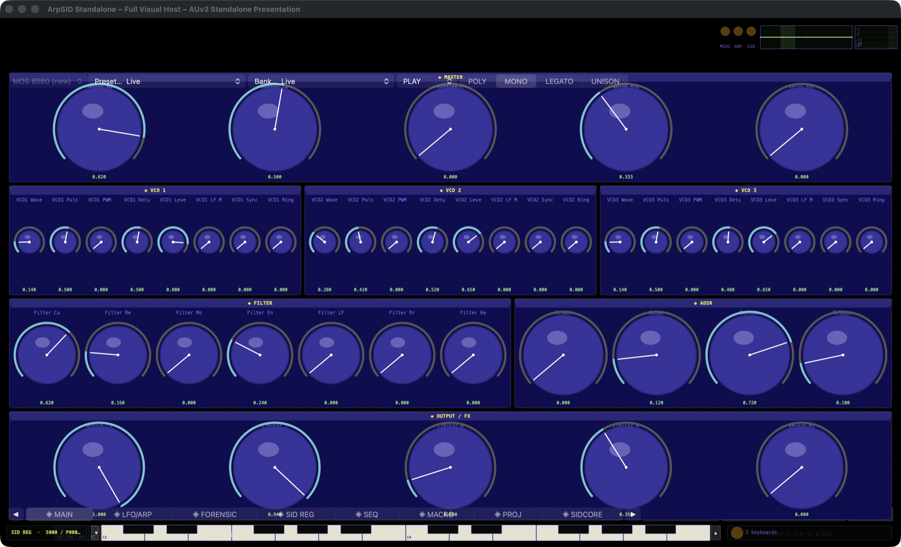
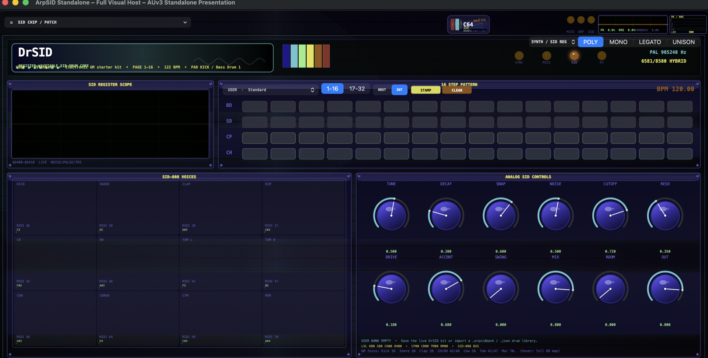
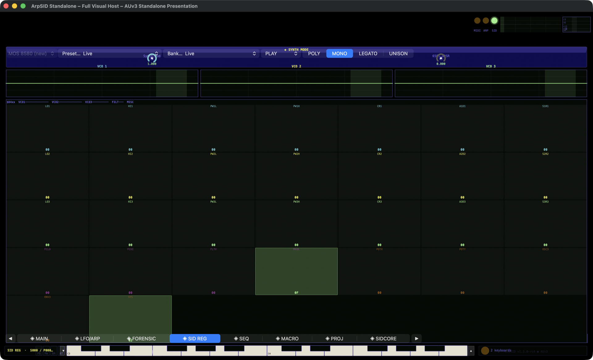

# ArpSID 0.0.690 pass380 - v970 test build-graph closure

Package: `0.0.690-pass380-v970-test-build-graph-closure`

**A Commodore 64 SID synthesizer and C64 tune player as an audio plug-in for macOS.**

ArpSID is a large, SID-accurate instrument built around a single canonical render
pipeline. It ships as Audio Unit (AUv2 and AUv3), VST3, and a standalone macOS host,
and combines faithful MOS 6581/8580 SID emulation, an authentic cycle-exact C64
PSID/RSID tune player, three drum engines, a DIGI sampler with authentic `$D418`
playback, and a full arranger (arpeggiator, 32-step sequencer, kit routing, mixer and
post-FX) — with host-accurate parameter display, automation and state restore.

---

## Screenshots

Captured from the ArpSID standalone host (AUv3 presentation), running the shipped build.



*Main synth view — Master section, three VCO banks (VCO1–3), the multimode Filter, ADSR envelope and the Output/FX stage.*



*DrSID register/wavetable drum core — 16-step pattern grid (BD/SD/CP/CH), the SID-808 voice bank with its General-MIDI note map, the live `$D400–$D418` register scope, and the Analog SID control bank.*



*SID-register (`$D400`) monitor — per-voice VCO, filter and envelope register read-outs for direct SynthMode inspection.*

---

## Plug-in formats

| Format | Notes |
|---|---|
| **AUv2** (`aumu`, manufacturer `ASID`) | Five component flavors: `ArpS` (ArpSID), `ArIn` (ArpSID Instrument), `DrSD` (DrSID drum machine), `S808` (SID-808), `C64P` (C64 tune player). |
| **AUv3** | App-extension + wrapper-app path on macOS. |
| **VST3** | Phase2 processor/controller path (built against the Steinberg VST3 SDK). |
| **Standalone** | macOS standalone host shell. |

Wrappers share the canonical core but declare capabilities explicitly: AU owns the
KIT/DIGI/MIX overlay layers; Phase2/VST owns the canonical core, fractional rendering,
exact post-FX and no-output continuation. "Parity" means shared contracts where
capabilities overlap — not forced feature identity.

## Sound engines

Each SID exposes three independent voices — triangle, sawtooth, variable-pulse and
noise waveforms, with per-voice pulse-width modulation, ring modulation and hard sync —
feeding one shared multimode filter (low-, band- and high-pass, selectable per voice)
and a master volume. ArpSID drives that silicon through several complementary engines:

- **BitPerfect / classic SID** — SID-accurate register, waveform, ADSR and multimode
  filter behavior; glide/portamento laws; fractional-cycle rendering.
- **SID-register / SynthMode** — direct `$D400`-register synthesis with a canonical
  voice-token identity model (real host note IDs are protected; anonymous/replayed
  notes use stable synthetic identities).
- **DrSID drum synthesis** — a distinct drum authority with per-hit register
  microprograms and two machine models (SID-authentic drum core and Analog X0X-8):
  kick, snare, closed/open hat, clap, cowbell, tom, rim.
- **SID-808** — an authored x0x-style analog projection with staged musical shapes
  (kick pitch-drop stages, tom pitch movement, hat ring/tail, clap burst train,
  cowbell partial/tail) and its own factory range.
- **DIGI sampler + authentic `$D418`** — import or record samples (decimated to the
  canonical ~8 kHz 4-bit `$D418` nibble stream) and authentic volume-DAC digi playback
  that follows the active PAL/NTSC SID clock.
- **C64 PSID/RSID player** — a cycle-exact PHI2 machine (NMOS 6510 CPU, CIA/VIC-II,
  open-bus, PLA) that runs real `.sid` tunes, with honest strict-RSID vs. compatible
  execution reporting.

## Arranger, routing and modulation

- **Arpeggiator** — mono/legato/unison/poly, fixed and host-synced rates, gate length,
  swing, octave range, hold/latch, transpose, portamento glide; internal gates are
  materialized into the canonical event queue at exact sample offsets.
- **32-step sequencer** — per-step note/velocity/gate, swing, internal or host-tempo
  following; explicit per-step boundaries shared by melodic events, KIT, float DIGI and
  authentic `$D418`.
- **KIT routing** — multi-target drum routing across DrSID / SID-808 / DIGI.
- **MIX** — per-voice volume/pan/mute/solo and insert FX.
- **Modulation matrix** — four LFOs plus velocity, note, key-follow, mod-wheel,
  pitch-bend, aftertouch, poly-pressure, random, eight macros and an envelope, routed to
  filter, oscillator, pulse-width, volume and LFO-rate targets.

## Post-FX

Reverb, output limiter, and the "Hi-Fi Transcendence" chain (oversampling, tape
saturation, analog warmth, psycho-exciter, stereo width, voice diffuser). All post-FX
parameter changes are applied on the exact canonical sample timeline — a value that
arrives at sample K never affects samples before K.

## SID authenticity and forensic modeling

- Three chip revisions selectable: MOS 6581 R2 / R3 / R4 and MOS 8580 R5.
- PAL and NTSC clock domains, with sample-boundary-safe transitions.
- Optional forensic analog modeling: clock jitter, supply ripple, thermal drift, voice
  crosstalk, external bleed, die temperature, supply voltage, per-chip seed, filter
  ohmic behavior and more.

## Host integration

- **Parameter presentation authority** — one shared, parameter-ID-aware service formats
  and parses every host-visible parameter across AUv2/AUv3/VST3 using the *same*
  canonical DSP laws (so displayed values match what the engine actually renders), with
  Unicode-safe VST3 strings.
- **Full parameter automation** — every host-visible parameter is automatable, and value
  changes take effect on the exact canonical sample timeline.
- MIDI CC → parameter mapping, opt-in GM channel-10 drum promotion, and PAL/NTSC-aware
  note handling.

## Standalone host & GUI

- **Standalone macOS host** — a full "visual host" shell that loads the AUv3 presentation
  with an on-screen velocity keyboard, transport (play / stop / record), tempo control and
  a preset/bank browser, so the instrument runs without a DAW.
- **Tabbed editor** — a MAIN synth panel (Master, three VCO banks, multimode filter, ADSR
  and Output/FX) plus dedicated LFO/ARP, SEQ, MACRO, KIT, DIGI, MIX, FORENSIC and SIDCORE
  pages.
- **Live SID register scope** — a `$D400–$D418` register monitor with per-voice VCO,
  filter and envelope read-outs plus PK/RMS output metering, driven only by
  render-published telemetry.
- **DrSID drum view** — a 16-step pattern grid, the SID-808 voice bank with its
  General-MIDI note map, and the Analog SID control bank.

See the [Screenshots](#screenshots) above.

## Presets, banks and state

- **180-slot factory patch bank** spanning the synth, DrSID, SID-808 and DIGI families.
- **User banks and kits** — save and recall user patches and drum kits, and import/export
  DrSID kits as `.arpsidbank` / `.json` drum libraries.
- **Full state restore** — the complete instrument state, including the DIGI user-sample
  bank, is serialized for host save/restore and cross-format state transfer.

## Architecture highlights

- **Canonical render pipeline** — one timed-event ordering authority survives ingress,
  storage and dispatch; structural (engine/model/PAL-NTSC) changes are sample-boundary
  safe; no-output blocks still advance the full pipeline into fixed scratch.
- **Realtime-safe** — render paths are lock-free, allocation-free and bounded; heavy
  producer work (parsing, canonicalization, file I/O) happens off the render thread and
  is published through mailboxes.
- **Render-owned telemetry** — the GUI consumes immutable/atomic snapshots with frame-ID
  coherence rather than reading live render state.
- **C64 render transactions** — a play/service attempt that may overflow rolls back CPU,
  CIA/VIC, RAM/Color-RAM, SID bridge and diagnostics atomically.

## Building

Requires a C++17 toolchain and CMake. On macOS, Xcode provides the AU/AUv3/standalone
toolchain; VST3 additionally needs the Steinberg VST3 SDK on the include path.

```bash
# Configure + build (Linux-buildable core + tests)
./build.sh --build-dir build-release --config Release --parallel 4

# Full test suite
ctest --test-dir build-release --output-on-failure

# macOS: build, install and strict-validate the AUv2 component
./build.sh --install-auv2 --clear-au-cache --validate-auv2 --parallel 8

# Create a clean source release archive
./build.sh --package-release --parallel 4
```

Repository guards (run before/after changes):

```bash
python3 scripts/check_version_coherence.py
python3 scripts/verify_source_tree.py
python3 scripts/check_audit_closure.py
```

## Testing

The suite registers **485+ tests** spanning source-contract, unit, runtime-behavior,
audio-shape, timing/clock-conservation, state/persistence, GUI-wiring and release/manifest
classes. `AI2AI_ARPSID_V965_LOWLEVEL_HANDOFF.md` documents the engineering contracts and
the audit playbook; `STATUS.md` / `TODO.md` track the closure ledger.

## Project layout

| Path | Contents |
|---|---|
| `include/arpsid/core/` | Canonical runtime, event queue, timing, C64 machine, post-FX, telemetry. |
| `include/arpsid/engines/` | BitPerfect, arpeggiator, DrSID, SID-808, DIGI sampler / `$D418`. |
| `include/arpsid/gui/`, `include/arpsid/patchbank/` | GUI models; factory patch/kit banks. |
| `source/au2/`, `source/au3/` | AUv2 component, AUv3, DSP kernel, view controller. |
| `source/arpsid_processor_phase2.*`, `source/gui/` | VST3 processor/controller and GUI. |
| `source/tests/`, `scripts/` | Test suite; build/validation/guard scripts. |

## Status and validation limits

Source-complete for the audited, Linux-buildable core with a green test suite. The
following remain external, platform sign-off items and are **not** claimed as verified:
macOS AUv2/AUv3 + Logic host validation, code signing / notarization / installer, a full
build against the real Steinberg VST3 SDK in a host matrix, sanitizer/fuzz coverage, and
strict physical C64 exactness beyond the documented boundaries
(`C64_EXACTNESS_BOUNDARIES.md`).

## Licensing

ArpSID is **Copyright (C) 2024-2026 Ulf Bertilsson** and is licensed under the
**GNU General Public License, version 3 or later (GPL-3.0-or-later)** — see the
[`LICENSE`](LICENSE) file. Some source files also carry earlier per-file
BSD-3-Clause / MIT SPDX headers; those permissive terms are GPL-compatible, and
the project as a whole is distributed under the GPL.

**C64 ROMs are not covered by this license.** The Commodore KERNAL, BASIC and
CHARGEN ROM images are copyrighted by their respective owners. This public
source does **not** bundle them (`c64_embedded_roms.h` ships zero-filled
placeholders); supply your own dumps at runtime. Do not redistribute the ROMs
without appropriate rights.

---

## Release history

ArpSID follows a strict per-pass "closure" discipline: every change lands as a
numbered, test-pinned entry. The recent milestones are summarized here; the complete
pass-by-pass audit trail is preserved (collapsed) below them.

### Recent milestones

- **v970 — test build-graph closure.** Compile the heavyweight `forensic_patch_bank.cpp` once into a static `arpsid_forensic_patchbank` library that 14 test targets link, instead of recompiling it per target. No shipped-artifact change.
- **v969 — test-suite integrity.** Audited every test source, restored one genuinely-orphaned guard (`auv3_render_scratch_transport_v591`), and de-flaked the triple-buffer multi-consumer test. No production source changed.
- **v968 — DrSID kit-save normalization.** User-kit SAVE normalizes to DrSID mode (`DrSidEnable=1`/`SynthMode=0`) for `.arpsid`/`.json`, and four pre-v965 tests were re-pinned to current contracts.
- **v967 — DrSID quick-kit parity.** Re-synced the GUI "Standard" quick-kit tone table to the factory base voicing and fixed the slot-(-1) no-op apply path.
- **v966 — parameter presentation authority.** One shared, parameter-ID-aware service formats/parses every host-visible parameter across AUv2/AUv3/VST3 using the canonical DSP laws, with real UTF-8⇄UTF-16 for VST3.
- **v965 — canonical render pipeline closure.** One timed-event ordering authority across ingress, storage and dispatch; sample-boundary-safe structural changes; exact-offset post-FX; render-owned telemetry.

<details>
<summary>Full pass-by-pass closure changelog (preserved audit trail)</summary>

### v970 — test build-graph closure (handoff 22.7)

- `source/forensic_patch_bank.cpp` (a heavyweight TU) was recompiled from source by 14 separate test executables. It is now compiled once into a static library `arpsid_forensic_patchbank` that those tests link, cutting duplicate compilation and peak build memory without weakening isolation. Verified ODR-correct by a clean full build (no duplicate-symbol errors).
- Production wrappers (VST3, AUv2 GUI smoke) are unchanged — they still compile their own copy (separate binaries), so no shipped artifact changes. The AU-kernel header extraction was deliberately left out (too risky for the payoff here; still open under 22.7).
- Regression coverage: `BuildGraphForensicPatchbankLibV970Tests`. No production/runtime source changed.

## pass380 / v969 test-suite integrity closure

Package: `0.0.690-pass380-v969-test-suite-integrity-closure`

## pass380 / v969 - test-suite audit: restore dropped coverage + de-flake

- Audited all 491 test sources for orphaned/obsolete/flaky tests. Found **nothing genuinely legacy/obsolete to remove**: the apparent orphans test live behavior and are mostly registered via string-constructing CMake `foreach` loops that a filename grep can't see; removing them would delete real coverage.
- Restored the one genuinely-orphaned source, `auv3_render_scratch_transport_v591` (AUv3 render-scratch/transport guard), into the build; made its one drifted assertion (stable-scratch helper `static inline`→`static constexpr`) linkage-tolerant.
- De-flaked `ScopeTripleBufferMultiConsumerV687Tests`: the producer now ends the run only after both consumers make progress (bounded), so a thread starved under a loaded parallel CTest can't fail the progress assertion; coherency/monotonic invariants unchanged.
- Regression coverage: `TestSuiteIntegrityV969Tests`. Full suite green; no production source changed.

## pass380 / v968 DrSID kit-save normalization + full-suite green

Package: `0.0.690-pass380-v968-drsid-kit-save-and-queue-test-closure`

## pass380 / v968 - DrSID user-kit save normalization and pre-v965 test repair

- DrSID user-kit SAVE now normalizes the saved document into DrSID mode (DrSidEnable=1, SynthMode=0) for both `.arpsid` and `.json`, via a dedicated `_saveDrumKitDocumentToURL` — matching the import/export paths. A kit saved while the engine was in another render mode no longer loads back as a non-drum patch.
- Repaired four pre-v965 tests that still asserted superseded contracts (476/480 → green): `ReleaseFinalClosureV404Tests`/`ReleaseRuntimeClosureV408Tests` (PIPE-013 release-reserve admission + PIPE-001 arrival-order/emergency-kill sort), `ClassicModeAuthorityClosureV909Tests` (published telemetry ARP/SEQ authority atomics), and `GuiViewControllerWiringV590Tests` (multi-line DIGI render call). Re-pinned to current behavior, not weakened.
- Regression coverage: `DrSidUserKitSaveModeNormalizationV968Tests`.

## pass380 / v967 - DrSID quick-kit base-profile parity and Standard-kit no-op fix

- The on-screen DrSID quick-kit popup overlays a GUI tone/motion table on top of the factory patch. Its "Standard" row is authored to mirror the canonical factory DrSID base voicing; v909 lengthened the factory base tom decay (0.30→0.44) but the GUI table was never updated, so the popup played a shorter tom than the same kit recalled from the host program list. The GUI base is re-synced to the factory base (`0.44`).
- The "Standard" quick kit (GUI-only, slot -1) applied nothing to audio yet reported "Loaded DrSID kit Standard" — the deferred-apply guard returned early for negative slots. GUI-only kits now apply their curated realtime profile; only the factory-patch load is skipped when no slot backs the kit.
- Regression coverage: `DrSidQuickKitBaseProfileParityV967Tests` pins the Standard-base ↔ factory-base tom-decay invariant (so either side changing alone fails the build) and the slot-(-1) apply path.
- The curated quick kits (Taiko, Cymbal FX, Impact FX, …) remain deliberately distinct voicings and are unchanged.

## pass380 / v966 - host parameter display/parse authority and VST Unicode closure

- One shared parameter-ID-aware presentation service (`sid_parameter_presentation.h`) now formats, parses and types every host-visible parameter for AUv2, AUv3 and VST3; wrapper-local unit-string formulas are gone.
- Host text now matches the canonical DSP laws: exponential LFO rate (norm 0.2 shows 0.2885 Hz, not 4000 Hz), limiter attack/release ms laws, quadratic portamento, sequencer tempo 20 + 280 × norm, and labeled enums/booleans.
- Host text entry inverts the same laws per parameter (`160 bpm` → norm 0.5, not clamped 1.0), accepts labels case-insensitively and both `.`/`,` decimals, and never mutates the value on invalid input.
- VST3 UTF-8 → UTF-16 is real bounded decoding (surrogate pairs, U+FFFD replacement, truncation-safe) instead of a byte cast; VST editor stderr diagnostics are compile-time gated.
- The LFO/limiter/sequencer laws moved to `math_utils.h` as single-authority helpers with inverses; runtime call sites delegate with unchanged numeric behavior.
- Regression coverage: `ParameterPresentationAuthorityV966Tests` (roundtrip across every parameter, handoff regression values, UTF conversion, wrapper delegation contracts).

## pass380 / v965 - canonical timing, overlays, post-FX and telemetry closure

- One final canonical event ordering law now survives ingress merge, queue storage and dispatch; physical cycle/subphase order and emergency sample-boundary kills remain explicit exceptions.
- BitPerfect ARP gates are materialized into the canonical queue at exact sample offsets. A render-local ARP simulation replays same-block MIDI and relevant automation, eliminating block-late first notes without double-advancing the live arpeggiator.
- Render-mode and PAL/NTSC structural changes are sample-boundary safe; no physical sample is partially owned by two engines or sliced with a stale clock.
- Sequencer step boundaries are explicit and shared by melodic events, KIT, float DIGI and authentic D418, including multiple steps in one host block.
- Reverb, limiter and Hi-Fi automation is applied at exact canonical sample offsets in AU and Phase2/VST.
- AU no-output processing renders the full pipeline into fixed scratch; telemetry reads only render-published atomics and accepts scope frames only when their frame ID matches the scalar snapshot.
- Authentic D418 follows the active PAL/NTSC SID clock. Queue headroom is reserved for releases/emergency controls, replacement recomputes cycle metadata, and VariantChange is applied once.
- Wrapper capabilities are explicit: AU owns KIT/DIGI/MIX overlays; Phase2/VST owns canonical core, fractional rendering, exact post-FX and no-output continuation.
- Preserves and integrates the v962 user-kit/popout wiring, v963 accessibility/tooltips, and v964 C64 SIDPLAY telemetry closures.
- Added `CanonicalRenderPipelineClosureV965Tests` and `VersionCoherenceV965Tests`. The merged source registers 479 tests; 18 focused cross-layer tests passed in this repair environment. Full macOS AU/Logic and SDK VST3 validation remain release-platform sign-off items.


## pass380 / v952 - Classic/BitPerfect, DrSID/SID808 and state/parameter behavior closure

- SID808 GUI KIT patterns now re-arm correctly on Play, Stop→Play, state apply, mode transitions and AU transport reset. A real kernel render test verifies routed SID808 hits and non-silent audio after each boundary.
- Normalized parameter repair is genuinely parameter-specific. One shared contract types boolean flags, enums, sequencer lengths, MIDI values, factory identities, modulation sources and SID register bytes, while preserving legacy floor-bin meaning.
- AUv2/VST3 discrete metadata now comes from that shared contract; AU3 boolean unit metadata does too.
- Queue-full parameter fallback is generation ordered, applies through the normal side-effect path, and cannot be overwritten by older queued values.
- AU3 and Phase2 state-root apply reconcile persistent local policy without adding realtime state-root canonicalization/mutation.
- C64 SID Player remains a separate player/component authority exposed through player telemetry and the unified audible-authority UI; the internal synth resolver remains the three-mode BitPerfect/SID-register/DrSID model.
- Local source validation: 465/465 CTest tests passed. Platform-specific AU/Logic/VST3/signing checks remain external.

## pass380 / v871 - C64 render transactions, SynthMode voice tokens, and SID808 factory-shape closure

- **C64 render rollback is now a single transaction:** the kernel bridge transaction now captures the C64 SID bridge, the C64 runtime SID sink, the PHI2 machine, and the platform mutation journal as one render-owned unit. Rollback restores CPU/CIA/VIC/memory/open-bus/diagnostic state, SID sink readback/write counters, bridge timed writes, D418 telemetry, and platform RAM mutations together instead of only rewinding a small register subset.
- **Dirty-log wrap is no longer permanent:** a wrapped PHI2 dirty-write log inside an active render transaction now defers the expensive full 64 KB platform sync until commit. Rollback restores the PHI2 snapshot and clears the deferred state, so a failed render slice cannot permanently force full RAM copies.
- **C64 drop pressure is visible:** hitting `kC64PsidMaxPlayCallsPerAudioBlock` now increments dedicated cap-hit and dropped-due-call telemetry, including last-block and max-block dropped counts. Rollback proof failures are also counted so failed platform journal rollbacks cannot hide behind audio symptoms.
- **SynthMode voice identity now survives canonical replay:** `SidTimedEvent` and AU canonical `TimedEvent` carry `voiceToken`, held replay stamps note-on and note-off events with the original token, the scheduler can bind an explicit token, and SynthMode NoteOff prefers the canonical token over channel/note/noteId lookup. This closes the remaining anonymous replay/stuck-note identity drift path without weakening real host note-id protection.
- **SID808 factory musical shape is guarded across every factory kit:** factory slots 120..149 now prove Kick factory source/stages use triangle with pulse width 0, Tom pitch-drop stages use triangle with pulse width 0, OpenHat keeps a bounded noise ring, Clap keeps its burst/tail train, and Cowbell rings without a late release bloom. Explicit per-hit waveform overrides remain valid; the factory and staged microprograms are the constrained paths.
- **Kick/Tom/Cowbell refinements:** factory Kick no longer starts from a pulse source, Kick/Tom micro-stages force triangle register shape, and Cowbell's final partial/tail level is reduced so release does not grow louder after the hit should be decaying.
- **Regression coverage expanded:** new guards are `C64RenderTransactionV871Tests`, `SynthModeVoiceTokenV871Tests`, and `Sid808FactoryMusicalShapeV871Tests`. The stack/journal source guards were updated so `C64Runtime` owns the platform mutation journal and the large bridge snapshot stays off the render stack.
- **Validation/install:** full release build PASS; full CTest 394/394 PASS; AUv2 install PASS; strict installed AUv2 validation PASS; AU/Logic component refresh PASS; `auval -a` lists `ArIn`, `ArpS`, `C64P`, `DrSD`, `S808`. Installed AUv2 binary SHA256: `2249ae85f5610e57e359951719bae609bc589fe060b9b57adbe4530027250da0`.
- **Documentation:** see `C64_SID808_SYNTHMODE_CLOSURE_V871.md` and `RELEASE_NOTES_V871.md`.

## pass380 / v870 - SID-808 musical-shape closure

- **Kick now has a real falling pitch program:** SID808 Kick starts above the authored body pitch, then drops through punch/body/tail stages without retriggering the gate. The one-shot hold window is extended so the tail is heard instead of being cut immediately.
- **Tom now drops instead of staying high/static:** SID808 Tom starts above the body pitch and descends through staged triangle-body registers, with a lower default body pitch and a longer tail window.
- **OpenHat now rings:** OpenHat stays noise-based, opts into high-pass filter shaping, and runs staged level/frequency changes so attack, ring, and late tail are all measurable.
- **Clap now has an internal burst train:** the first noise onset is followed by scheduled gated noise bursts and a lower noise tail, replacing the old single-tick behavior.
- **Cowbell now has alternating pulse partials:** Cowbell switches between pulse partial frequencies/pulse widths before settling into a band-pass shaped ringing tail.
- **SID808 stage scheduling is generalized:** `Sid808Engine` now has a bounded four-stage per-voice microprogram, not just the old single snare body stage. Block rendering chunks at scheduled stage and release boundaries.
- **Explicit panic/setup boundaries are clean:** SID808 `allNotesOff()` now force-idles the three SID voices and clears filter routing, preventing long hat/cowbell/tom tails from bleeding into muted-hit telemetry or the next setup state.
- **Clean-room include fix:** `SidRuntimeHostSurface` includes `<cstddef>` and `<cstdint>` directly for `std::size_t`, `std::int32_t`, and `std::uint32_t`.
- **Regression coverage expanded:** `Sid808MusicalShapeV870Tests` guards kick/tom pitch movement, open-hat ring, clap burst train, cowbell partial/ring behavior, and the named microprogram source hooks.
- **Validation/install:** full CTest 391/391 PASS; SID808 closure cluster 5/5 PASS; AUv2 build/sign PASS; AUv2 install/strict validation PASS; AU/Logic cache backup moved to `~/Library/Caches/ArpSID-cleared-logic-au-cache-20260704-201718`; `auval -a` lists `ArIn`, `ArpS`, `C64P`, `DrSD`, `S808`. Installed AUv2 binary SHA256: `6c8a5f336c7e73643b7037d8fc05755c76e1ad509897dcc1910dae0d902a7042`.
- **Documentation:** see `SID808_MUSICAL_SHAPE_CLOSURE_V870.md` and `RELEASE_NOTES_V870.md`.

## pass380 / v869 - SynthMode held replay, stuck-note reconciliation, and audible SID-808 snare body

- **AU raw MIDI held replay no longer invents real host note IDs:** held-ingress replay lanes now use `SidRuntimeHostSurface::makeSyntheticAnonymousNoteId()`, which produces stable negative synthetic IDs. Replayed raw MIDI notes keep independent replay identity without becoming positive VST/AU host-noteId voices, so a normal noteId-less NoteOff can release them.
- **SynthMode stuck-note safety now covers direct SID-register mode:** `VoiceAllocator` exposes orphan reconciliation with held-ledger cleanup, and both AU and Phase2/VST call it once per rendered block in direct SynthMode when arp and sequencer are disabled. A lost/mismatched NoteOff must be absent from the host held-key mirror for two consecutive passes before the SID gate is dropped, preserving boundary safety while preventing guitar/mono/legato/unison stuck notes.
- **VST/Phase2 held-key mirror added:** Phase2 MIDI NoteOn/NoteOff ingestion now updates `SidRuntimeHostSurface` held lanes before the reconciler runs, including real note IDs when supplied and negative synthetic anonymous IDs otherwise.
- **Real host note IDs remain protected:** anonymous NoteOff still cannot steal a positive host-noteId voice; the new negative synthetic IDs are the compatibility path for raw anonymous replay only.
- **SID-808 snare body is now audible, not merely register-visible:** the delayed snare body micro-stage retriggers with a real gate edge after the noise snap. `Sid808SnareBodyRoutingV869Tests` pins snap RMS, body-window RMS, body peak, and a body/snap RMS ratio so the body cannot silently collapse again.
- **SID-808 shared-voice filter routing is live-state based:** `Sid808Engine` now tracks active drum, flags, and filter mode per physical SID voice. Snare/Clap/Rim still share voice 1, but Clap and Rim replace Snare as the active owner and clear Snare's BP+HP route instead of inheriting it from factory table data.
- **SID-808 active-but-inaudible states are visible:** bridge telemetry now publishes active SID808 voice count, below-audible active block count, literal zero-peak active block count, raw pre-DC peak/mean, post-DC peak/mean, DC-blocker coefficient/reset count, and a GUI authority state of `SILENT-ACTIVE` when a routed SID808 voice is active below the audible floor.
- **SID-808 snare stage telemetry is render-published:** snare snap/body RMS, snap/body peak, body-stage applied count, and late-stage count are exposed beside the audio assertions so register-visible-but-inaudible body regressions show up immediately.
- **Regression coverage expanded:** `SynthModeHeldReplayIdentityV869Tests` guards negative synthetic IDs, anonymous release compatibility, real host-ID protection, AU source shape, VST held mirror, and SynthMode ledger cleanup. `Sid808SnareBodyRoutingV869Tests` guards audible snare body energy and active-drum filter ownership.
- **Validation/install:** full CTest 390/390 PASS; AUv2 build/sign PASS; AUv2 install/user-cache refresh PASS; explicit Logic/AU cache folders moved to `~/Library/Caches/ArpSID-cleared-logic-au-cache-20260704-160646`; `auval -a` lists `ArIn`, `ArpS`, `C64P`, `DrSD`, `S808`; strict `auval` PASS for all five subtypes. Installed AUv2 binary SHA256: `6a57b3725c9e8fbe184c038bf6cb1f18e243d120fcba865dce9dd989254adc7e`.
- **Documentation:** see `SYNTHMODE_SID808_CLOSURE_V869.md` and `RELEASE_NOTES_V869.md`.

## pass380 / v868 - SID-808 snare complete closure

- **SID-808 no longer gates the default melodic voice before drum programming:** `Sid808Engine` now reserves the fixed physical SID voice through `forceNoteOnVoiceBookkeepingOnly()`. The allocator/choke/active-count state is still correct, but SID808 writes its own frequency, pulse width, waveform, filter routing, ADSR, level, and gate state before the audible gate rises. This closes the remaining first-sample ownership gap from the snare audit.
- **Snare has a real snap/body microprogram:** every SID808 snare hit starts as a short high-frequency noise-only snap, then the render loop switches to the authored pulse+noise or noise body after about 7.5 ms. Block rendering now chunks at both micro-stage and one-shot release boundaries so the switch lands on the audio timeline instead of being delayed to the next host block.
- **Runtime snare sanitizer is fail-closed:** snare overrides cannot accidentally become pulse-only sustained tones. The runtime snare path forces a noise component, zeroes the sustain nibble, and opts into SID filter routing while preserving the authored/overridden pitch, pulse width, decay, release, and level.
- **Factory snare filter shaping is now authored data:** all canonical SID-808 factory slots 120..149 resolve to snare configs with the filter flag set, matching the runtime snare high-pass/band-pass shape.
- **Shared-voice filter routing is current-hit owned:** Snare, Clap, and Rim share SID voice 1. v868 routes the current physical voice from the current hit's config rather than from another drum family's table row, so snare filtering cannot dull Clap/Rim hits on the same voice.
- **Regression coverage expanded:** `Sid808SnareCompleteClosureV868Tests` proves allocator-only SID808 ownership, no old `forceNoteOnVoice()` default-gate path, factory snare filter flags across slots 120..149, runtime pulse-only snare override sanitization, and live snap-to-body register changes.
- **Validation/install:** `Sid808SnareCompleteClosureV868Tests` PASS; `Sid808AudibleAuthorityV865Tests` PASS after the shared-voice filter fix; `Sid808SnareOneShotV867Tests` PASS; full CTest 388/388 PASS; AUv2 build/install/cache refresh/strict validation PASS; codesign PASS; `auval -a` lists `ArIn`, `ArpS`, `C64P`, `DrSD`, `S808`. Installed AUv2 binary SHA256: `fc863eccdc85890b8dc896256a0febf7897f986975ae1fc3b591e640a6907304`.
- **Documentation:** see `SID808_SNARE_COMPLETE_CLOSURE_V868.md` and `RELEASE_NOTES_V868.md`.

## pass380 / v867 - SID-808 snare realism, one-shot gate safety, and SIDPLAY register-engine parity

- **SID-808 snares now author real noise:** all canonical factory slots 120..149 resolve to snares with the SID noise bit set. Classic/Punch/Hard/Wide snares use pulse+noise (`$C0`) for body plus transient crack, while Lo-Fi uses pure noise (`$80`) for the softer texture.
- **Factory one-shots no longer drone:** factory SID-808 kit sustain nibbles are zero for every drum family, and the slot-variation layer preserves zero sustain for one-shot drums. This prevents snare/hat/clap/cowbell/tom/rim patches from behaving like held synth notes.
- **SID-808 gate timing is hardened:** the engine now drops GATE before reprogramming frequency, pulse width, waveform, filter routing, ADSR, and voice level, then raises GATE only after the new hit is fully configured. Each drum family also has a render-time auto-release window so stale held gates cannot survive a one-shot hit.
- **Block rendering remains voice-slot correct:** SID-808 block rendering chunks at auto-release boundaries, allowing the underlying single-SID allocator to enter release and garbage-collect freed voices instead of leaving active-count/readback state stale.
- **Wrong-snare regression coverage added:** `Sid808SnareOneShotV867Tests` validates every factory slot 120..149 for snare noise-bit authorship, zero sustain on every factory one-shot, audible attack, no 500 ms+ drone, transient noise-like zero-crossing density, and voice release after a 1-second render.
- **SIDPLAY pulse-width edge fixed in the register engine:** `SidRegisterEngine` no longer treats `$FFF` pulse width as constant-low. `$000` remains the expected degenerate constant-high edge, `$800` is the midpoint comparator, and `$FFF` now produces the one-step high spike expected from the 12-bit comparator.
- **C64/SIDPLAY `$D418` digi output is enabled on the register-engine path:** C64 SIDPLAY register engines enable volume-DAC emulation during the player handoff/render path, so tunes using master-volume nibble edges for digi/percussion can be heard through the same register backend that SIDPLAY actually uses.
- **Dense timed-write pressure stays diagnosable:** `SidplayRegisterEngineV867Tests` guards subphase queue overflow telemetry so write pressure remains visible instead of silently disappearing during dense SID register bursts.
- **Validation/install:** new v867 guards PASS; focused SID808/SID-core/D418/restore CTest set 22/22 PASS; full CTest 387/387 PASS; AUv2 bundle build PASS; direct AUv2 component smoke PASS; direct AUv2 SID-808 smoke PASS; AU3 SID-808 render-event smoke PASS; AUv2 install/cache refresh/strict validation PASS; installed AUv2 component smoke PASS; installed SID-808 smoke PASS; codesign PASS; `auval -a` lists `ArIn`, `ArpS`, `C64P`, `DrSD`, `S808`. Installed binary SHA256: `878f6216738f820d2d752affb886a03861090f8ceb5994d2a4da73d63fef8ccc`.
- **Documentation:** see `SID808_SNARE_AND_SIDPLAY_REGISTER_CLOSURE_V867.md` and `RELEASE_NOTES_V867.md`.

## pass380 / SID-808 v866 — scheduled telemetry authority closure

- **Delayed scheduled hits now publish routed-hit truth:** `DrumEngineHostBridge::processBlock()` routes delayed `noteOnAt(offset > 0)` and `noteOnAtWithOverride(offset > 0)` events through the bridge note surface instead of calling the router directly, so sample-accurate transport/sequencer hits update `routedHitCount`, last drum, last MIDI note, velocity, context, and output peak consistently.
- **Behavioral guard coverage expanded:** `Sid808AudibleAuthorityV865Tests` now covers delayed Kick, delayed override Clap, multiple delayed hits in one block, block-end scheduled hits that sound in the next block, and scheduled queue overflow counting.
- **Threading contract clarified:** the scheduled ingress is documented as render-thread sequencer ingress, deterministic and fixed-capacity, but not a cross-thread GUI/host producer queue.
- **Validation/install:** focused SID-808 CTest set 8/8 PASS; direct AUv2 component smoke PASS; direct AUv2 SID-808 smoke PASS; AU3 SID-808 render-event smoke PASS; AUv2 install/cache refresh/strict validation PASS; codesign PASS. Installed binary SHA256: `f55909a0dfe07b32816a97e2ea2d7fe2c9b5fc4d7be7b87aa9f1924a9d142744`.
- **Documentation:** see `SID808_SCHEDULED_TELEMETRY_CLOSURE_V866.md` and `RELEASE_NOTES_V866.md`.

## pass380 / SID-808 v865 — audible authority and bridge telemetry closure

- **Audible-minimum guard for every SID-808 drum:** `Sid808AudibleAuthorityV865Tests` now renders Kick, Snare, ClosedHat, OpenHat, Clap, Cowbell, Tom, and Rim through `DrumEngineHostBridge` and requires finite, non-silent peak/RMS output for every family.
- **Waveform/control-bit conversion hardened:** SID-808 kit load, GUI conversion, hit overrides, and final voice programming now accept both raw SID control waveform masks (`$10/$80`) and internal waveform nibbles (`0x01/0x08`). Valid internal noise/pulse values can no longer be masked to waveform zero by `& 0xF0`.
- **SID-808 bridge telemetry is first-class:** `DrumEngineHostBridge` publishes configured kit slot, routed-hit count, last routed drum class, last routed MIDI note, last routed velocity, active SID-808 context, and measured output peak.
- **Render-owned bridge truth reaches the AU snapshot:** the kernel publishes SID-808 post-DC bridge peak and replacement/fail-open state; when SID-808 owns audio, drum levels come from `Sid808Engine`, not stale canonical DrSID telemetry.
- **Unified audible-authority display:** the AU HUD and drum panels show `AUTH SID808-BRIDGE`, `KIT###`, hit count, bridge peak, and `REPL`/`FAILOPEN`/`IDLE`. Drum meters, LEDs, HUD glow, and output dB include `tel.sid808OutputPeak`.
- **Validation/install:** `Sid808AudibleAuthorityV865Tests` PASS; focused SID-808/transport/no-silence CTest set 8/8 PASS; AUv2 bundle builds; direct AUv2 component smoke PASS; AUv2 SID-808 component smoke PASS; AU3 SID-808 render-event smoke PASS; AUv2 install/cache refresh/strict validation PASS; codesign PASS. Installed binary SHA256: `8769abd235de63e86bace95a34f5651843f0edb65d385d432582553a2954bdbc`.
- **Documentation:** see `SID808_AUDIBLE_AUTHORITY_CLOSURE_V865.md` and `RELEASE_NOTES_V865.md`.

## pass380 / SID-core v864 — low-level SID parity and timed-write closure

- **Pulse-width edge cases retained and guarded:** `SidCoreExactnessV854Tests` and `C64PlayBridgeRoutingV855Tests` keep `$000` constant high, `$800` 50 percent duty, and `$FFF` as a 1/4096-duty spike in both audio and `$D41B` readback.
- **TEST/noise reset parity:** audio `SIDVoice` and C64 `SidReadbackModel` now have guarded TEST release behavior: TEST holds OSC output at zero, resets phase/LFSR, and releases into the same noise sequence as a fresh reset voice.
- **Hard-restart timing pinned:** `scheduleHardRestart()` drops gate immediately, does not re-gate early, and re-gates exactly on the 46th service tick.
- **Sync/ring source timing parity:** `SidReadbackModel` now uses the same no-cascade hard-sync law as `SIDChip`, so a source oscillator synchronized on the same edge does not propagate a false reset through the three-oscillator ring.
- **Filter routing/cutoff law guarded:** filter mode bits remain combinable (`Notch == LP+HP`, `LP+BP+HP` legal), 6581 cutoff is monotonic, resonance raises Q, and 8580 high cutoff remains brighter than 6581 calibration.
- **`$D418` master-volume DC fixed:** revision calibration DC is now before the DC/RC output stages and scaled by the master-volume DAC, so volume 0 settles near silence while volume changes still produce D418-style transients.
- **Native timed-write helpers fixed:** `sidChipAdvanceCyclesNative()` advances exact SID cycles instead of host samples, subcycle advancement uses the shared 256-step lattice directly, partial-cycle interval rendering no longer depends on host-sample planner state, and timed-write intervals keep half-open begin-inclusive/end-exclusive semantics.
- **Waveform-select compatibility fixed:** direct `SIDVoice::setWaveform()` callers can use either internal waveform nibbles (`0x01`, `0x08`) or raw SID control-register masks (`$10`, `$80`) without accidentally selecting waveform zero.
- **Readback parity for C64 tunes expanded:** OSC3/ENV3 remain live cycle-clocked reads, TEST/noise and sync behavior match the audio core, and `$D41B` pulse-width edge cases stay pinned.
- **Documentation:** see `SID_CORE_AUDIT_CLOSURE_V864.md` for the detailed audit closure matrix. Guard: `SidCoreAuditV864Tests`.
- **Validation:** full macOS closure passed (`release-logs/macos-closure-20260704-004703.log`): release-check 7/7, full CTest 384/384, strict installed AUv2 verification for `ArpS`, `ArIn`, `DrSD`, `S808`, and `C64P`. Installed binary SHA256: `fe08fbbf74ac4db795b77db039f2b20428e3768fc44bffc4e3956cfd37489a72`.

## pass380 / SID-808 v863 — Logic/AUv2 audio-path closure

- **Root cause closed:** DrSID-mode canonical drum MIDI used `surface.triggerDrumMidi()`, but `CanonicalRuntimeBackend` inherited the base implementation that called canonical DrSID directly. GUI pads, sequencer hits, and MIDI notes could update canonical/runtime telemetry while bypassing `ArpSIDDSPKernel::runtimeTriggerDrSidNote()`, so the SID-808 bridge never received the hit.
- **Input authority fix:** `CanonicalRuntimeBackend::triggerDrumMidi()` and `releaseDrumMidi()` now route through the kernel target hook first. In SID-808 flavor that hook repairs/selects the SID-808 bridge identity and calls `drumEngineBridge_.noteOn(...)`; the old direct DrSID path remains only as the no-target fallback.
- **Output authority fix retained:** SID-808 bridge replacement is fail-open. The bridge replaces the final bus only when it has renderable activity (bridge peak, active voices, or a new note-on count), so silent bridge scratch cannot erase canonical fallback audio.
- **C64 cleanup retained:** C64 SIDPLAY branches before normal host/event/MIDI/seq work, bypass-state cleanup is edge-triggered, PHI2 SID-write edge capture no longer scans the dirty log, and dirty-log sync clears the consumed log so one wrap cannot force permanent 64 KB copies.
- **Validation:** full macOS closure passed (`release-logs/macos-closure-20260703-234236.log`): release-check 7/7, full CTest 383/383, `Sid808TargetRoutedDrumMidiV862Tests`, `DrumBridgeNoSilenceV613Tests`, `DigiMidiPadTransportStopV745Tests`, direct AUAudioUnit SID-808 render-event smoke, installed AUv2 SID-808 smoke, and strict installed AUv2 verification. Installed binary SHA256: `af2ea5def5d37e1ce6054aee12d99621203a0f6c31ccb7484a00507c3ec50af7`.

## pass380 / SID-808 v862 — target-routed canonical drum MIDI

- Added target-routed drum NoteOn/NoteOff overrides in `include/arpsid/core/sid_runtime_target_adapter.h`.
- Added `Sid808TargetRoutedDrumMidiV862Tests` so DrSID-mode canonical MIDI can no longer bypass the SID-808 bridge-owning kernel hook.

## pass380 / SID-808 v861 — fail-open bridge output and C64 hot-path cleanup

- SID-808 bridge bus replacement now requires renderable activity instead of copying a silent scratch buffer over the final output.
- GM drum notes are accepted on any MIDI channel for stopped-transport SID-808 audition paths.
- C64 PHI2 edge capture observes SID writes through the O(1) SID sink; dirty-write logs are cleared after platform sync; C64 bypass cleanup is edge-triggered.

## pass380 / sidplay v844 — true backlog telemetry, C64 bypass-note cleanup, open-bus scope truth

- **Context:** after v841, playback was less blocky but still reported choppy, and the C64P flavor could appear to leave poly/DIGI state stuck behind the pure SID player path.
- **Cycle behavior:** continuous C64 runtime pacing is still capped to the current AU buffer PHI2 span (`min(debtBeforeContinuousRun, continuousAudioBlockCycles)`). The backlog drop now runs only for genuine realtime backlog (`debtBeforeContinuousRun > continuousAudioBlockCycles`) after a completed cycle budget, while `noteC64Catchup_` records the true pre-cap debt so the GUI still exposes a spike instead of hiding it behind the run cap.
- **C64 player isolation:** the early C64 player branch now clears bypassed synth/BPE/DrSID/ARP/DIGI note state without entering the normal render path or routing normal all-notes-off SID writes into the C64 timed-write stream.
- **Open-bus visualization:** light C64 telemetry now carries real open-bus decay mask, hold state, latch age, last-driven cycle, and SID/Color-RAM/POTX/POTY open-bus read counters. The AU adapter fallback copies those real light-telemetry fields instead of faking a permanent held bus, and the realtime bus scope plots the decayed latch value instead of XOR eye candy.
- **Validation:** `C64RenderStallInstrumentationV840Tests`, `GuiTelemetryScopeClosureV743Tests`, and `C64ScopeTelemetryFixClosureV744Tests` pass directly; AUv2 builds/signs; local install/cache refresh/strict AU validation passes for the installed component.

## pass380 / sidplay v841 — continuous catch-up clamp (C64P choppiness fixed)

- **Field result:** after the v841 patch the user confirmed C64P SID playback in Logic is smooth: "sid played fine now".
- **Root cause:** the continuous C64 runtime path (RSID and PSID `playAddress == 0`) repaid all stale `c64PsidPassiveCycleDebt_` in one AU render callback. When the debt represented more PHI2 time than the current audio buffer could map, timed SID writes beyond the buffer were clamped to the last sample, creating a block-edge burst and the audible play-stop-play-stop pattern.
- **Fix:** the render path now tracks the PHI2 span accrued by the current AU buffer (`passiveCyclesAccruedThisBlock`) and caps continuous catch-up to that mappable span (`continuousAudioBlockCycles`). If the run completes, stale realtime backlog is dropped instead of compressed into the present block; incomplete/unsupported runs keep bounded debt for retry diagnostics.
- **Scope:** VBI and CIA-timed PSID paths were already bounded to a play period; this fix is for the continuous machine-runtime path only. The v840 render timers remain in the C64 cockpit for future diagnosis.
- **Guard:** `C64RenderStallInstrumentationV840Tests` now rejects the old `catchup = c64PsidPassiveCycleDebt_` shape and requires the audio-block PHI2-span cap.
- **Validation:** targeted C64 timing/continuous tests passed 7/7, AUv2 built and installed, codesign passed, all five AUv2 flavors were visible to `auval -a`, and Logic runtime playback was user-confirmed.

## pass380 / sidplay v840 — render-path stall instrumentation (localize the C64P choppiness)

- Since the v839 measurement proved the emulation runs at ~12x realtime (not the bottleneck), the C64P "play-stop-play-stop" choppiness had to be a **render-time scheduling/debt problem**. v840 added RT-safe instrumentation that exposed the debt-burst failure mode fixed in v841, from three independent perspectives:
  - **Render-side spike** — `c64 render µs (last/MAX)` and `c64 render overruns` (blocks whose wall time exceeded the audio deadline `numFrames·1e6/sampleRate`).
  - **Host-side jitter** — `c64 host gap µs (MAX)`: peak wall-clock gap between consecutive C64 block deliveries (is Logic delivering buffers late?).
  - **Debt feedback** — `c64 catch-up cycles (MAX burst)` (peak PHI2 cycles emulated in one continuous catch-up) and `c64 passive debt cycles (last)` (leftover debt, ~0 when healthy). This is the signal that identified the v841 bug: a delayed block could grow `c64PsidPassiveCycleDebt_`, and the old continuous path emulated that whole stale debt in one shot (`catchup = c64PsidPassiveCycleDebt_`, capped only by the multi-frame debt limit), forcing future timed writes to the current block edge.
- **Where to read it:** the C64 cockpit shows an always-visible line — `RENDER µs last/MAX … · OVERRUNS … · HOST GAP MAX … µs · CATCHUP MAX … cyc · DEBT … cyc` — and the full set also appears as six new rows in the C64 STATE diagnostic grid (SETTINGS ▸ Advanced ▸ diagnostic dashboard). Maxes reset on each tune load.
- **RT-safety:** the render thread only does two `steady_clock` reads per block and lock-free `compare_exchange` max updates; the GUI reads with relaxed loads. No locks, no allocation on the audio thread.
- **Diagnostic interpretation after v841:** `CATCHUP MAX` should stay bounded to the current buffer's PHI2 span, and `DEBT` should return to a healthy bounded value after a successful continuous run. `HOST GAP MAX` remains useful for spotting host scheduling jitter; `render µs MAX` / `OVERRUNS` remain useful for any future render-side regression.
- **Guard:** `C64RenderStallInstrumentationV840Tests`; schema bumped to v7 (`DiagCounterSnapshotV549Tests`, `C64StrictStatusGuiContractV729Tests` updated to 44 fields / 43 grid rows).

## pass380 / sidplay v839 — "6510 fast" toggle + measured proof the emulation is NOT the choppiness bottleneck

- **Added** a second realtime, **default-OFF** toggle button in the C64 control row: **`6510:ACC` ⇄ `6510:FAST`**. In fast mode the per-PHI2-cycle **diagnostics snapshot** (two CIA timer-phase snapshots + a ~40-field telemetry copy that exists only for the GUI/HUD) is skipped. **The 6510/CPU/CIA/VIC/SID emulation stays fully bit-exact** — this is *not* the policy-locked instruction-atomic engine; only the on-screen telemetry goes coarse while the toggle is on. The exactness ledger keeps reading its inputs from live sources (`mem_.openBusReads()`, the RMW counter, `cpu().unsupportedOpcodeTotal()`), so gating the snapshot is audio-safe.
- **Why this exists / measurement:** a standalone microbenchmark (`-O2`, identical instruction stream per mode) was run on the PHI2 machine to find where the per-cycle time actually goes:

  | mode | ns/cycle | vs accurate | realtime headroom |
  |---|---|---|---|
  | accurate (baseline) | ~84 | — | **~12× realtime** |
  | 6510 fast (diag gated) | ~78 | **−6.5%** | ~12.9× |
  | VIC fast | ~90 | **+7.8% (slower)** | ~11.2× |

- **Key finding — honest:** the cycle-accurate emulation core runs at **~12× realtime** on a single core. It is **not** what made C64P playback "play-stop-play-stop." The `6510:FAST` toggle saves only ~6%, and the v838 `VIC:FAST` toggle is actually measured **slightly slower** (forcing AEC high stops the CPU stalling on badlines, so it does *more* work per cycle) — which is exactly why toggling VIC fast/acc made no audible difference. **Neither fast button is the fix for the choppiness.** They are kept as default-off diagnostic/performance levers; the confirmed fix is v841's continuous catch-up cap.
- **Guard:** `C646510FastToggleV839Tests` (default-OFF + full GUI→kernel→PHI2 wiring + the `++phi2_` cycle advance stays outside the gate). Diagnostics guards `C64Phi2RsidExactInitV605Tests` / `C64CiaPhi2IntegrationV620Tests` still pass (they run with the default-accurate path).

## pass380 / sidplay v838 — user-togglable "VIC-II fast" mode for choppy C64P playback

- **Why it shipped:** while diagnosing C64P stop-start playback in Logic, v838 added a policy-safe, default-off way to remove VIC-II sprite/badline DMA and bus-steal servicing from the live PHI2 loop. Later measurement and the v841 field result proved the choppiness was **not** inherent CPU cost; the toggle remains useful as a diagnostic/performance lever, not as the final fix.
- **What shipped:** a realtime, **default-OFF** toggle button in the C64 control row that flips **`VIC:ACC` ⇄ `VIC:FAST`** live. In fast mode the PHI2 machine advances the VIC via `stepHalfCycles(2)` (raster counter + raster IRQ still advance, so `$D012`-polling tunes don't hang) but **skips** the per-cycle sprite/badline DMA and forces the CPU to keep the bus (no bus-steal stalls). **CPU/CIA/SID stay bit-exact** — only VIC-II cycle-exactness is traded, which is why it does **not** violate `ARPSID_C64_PHYSICAL_ONLY`.
- **Default is accurate.** Nothing changes until you tap the button; the toggle is per-session and not persisted, so reopening a project always returns to bit-exact VIC timing.
- **Wiring:** GUI `_c64ToggleVicFast:` → control-hub command 6 (on) / 7 (off) → `ArpSIDDSPKernel::setC64VicFast()` (`std::atomic<bool> c64VicFast_{false}`) → pushed into the live `C64PsidRuntime` player each render block → `C64Phi2Machine::setVicFast()`.
- **Honest limitation:** the legacy *instruction-atomic* "fast playback" engine (`runRealtimeSidCoreCycles`) is **not** exposed as a toggle. It is hard-locked out by the `ARPSID_C64_PHYSICAL_ONLY` accuracy policy (build flag + runtime `legacyMos6510RuntimePathsReachable()==false` + `physicalExactnessBlocker` mask + source/CMake guards `C64PhysicalOnlyPolicyV738Tests`, `PsidPlayZeroContinuousGuardV807Tests`, `StrictRsidFallbackTruthGuardV808Tests`). Re-enabling it would reverse a foundational exactness commitment, so it would require a deliberate `ARPSID_C64_PHYSICAL_ONLY=OFF` build variant rather than a button. VIC-fast is the policy-safe lever and was kept; the instruction-atomic routing was reverted.
- **Guard:** `C64VicFastToggleV838Tests` locks the default-OFF state and the full GUI→kernel→PHI2 wiring, and asserts VIC-fast never resurrects the instruction-atomic `fastPlayback_` routing.

## pass380 / logic-auv2 v843 — AU-host stack overflow in GUI realtime publish (Logic AU host)

- Fixed the Logic-only crash where inserting ArpSID showed a black editor and "An Audio Unit plug-in reported a problem". Confirmed from real post-reboot crash reports (`~/Library/Logs/DiagnosticReports/AUHostingServiceXPC_arrow-2026-06-29-2010*.ips`): `SIGBUS` / `Thread stack size exceeded` / `___chkstk_darwin`, faulting through `-[ArpSIDAudioUnit prepareStandaloneWithSampleRate:maxFrames:]` → `-[ArpSIDDSPKernelAdapter _publishSanitizedGuiRealtimeModels_v150]` → `ArpSID::ArpSIDDSPKernel::publishGuiRealtimeModels(...)`.
- Root cause: the GUI-realtime publish path built large value objects on the caller stack — chiefly `GuiRealtimeModelSnapshot_`, which embeds the **480,392-byte `DigiSampleBankBlob`** — and adapter/AU/editor paths copied transient `DigiSampleBankBlob` locals too. Logic's sandboxed/out-of-process `AUHostingService` worker stack is small enough that a single such copy hit the stack guard (`___chkstk_darwin`) before the editor (`-loadView`) ever ran. It survives `auval`/in-process/standalone because those run on larger stacks.
- Fix: keep all large GUI/DIGI objects off the worker stack. `publishGuiRealtimeModels` now fills the heap-owned mailbox `producerSlot()` in place (no local snapshot); the return-by-value snapshot helper was removed and `guiRealtimeRender_` is object-owned. `_publishSanitizedGuiRealtimeModels_v150` repairs/publishes the adapter's member `DigiSampleBankBlob` (no stack copy). AU state restore/save and the editor round-trip verify allocate transient banks on the heap (`std::make_unique<DigiSampleBankBlob>()`); DIGI defaults/resets use `resetDigiSampleBankBlob(...)` in place. The DSP kernel is also kept single-owner (`unique_ptr` / `make_unique`, synchronous PSID load).
- Guards: `DspKernelGuiRealtimePublishStackV843Tests` (stack-safe publish shapes) and `Auv2KernelOveralignedNoMakeSharedV836Tests` (single-owner kernel; no shared/make_shared/async shared capture).
- Correction: an earlier v836 hypothesis blamed `std::make_shared` under-aligning the over-aligned (`alignof 64`) kernel. That was **disproven** — `make_unique`, `make_shared`, and `shared_ptr(new)` all return 64-aligned `ArpSIDDSPKernel`. Alignment was never the cause; the real fault is stack exhaustion above.

## pass380 / logic-auv2 v835 — AUv2 editor synchronous build (remove deferred-build hang)

- Fixed Logic hanging when opening the AUv2 editor. The v826–v834 deferred AUv2 out-of-process editor-build machine installed a black placeholder and rebuilt the editor only after a `dispatch_after` delay that had been bumped to 7.5 s (and could reschedule indefinitely if the host window / first-paint fence never settled). The editor now builds synchronously in `-loadView`, matching the known-good pass353 baseline; the first-paint fence is pre-released so restored heavy tabs show immediately.
- Guard: `Auv2EditorSyncBuildNoDeferV835Tests`.

## pass380 / fix-order #58 — remove documented Non-RT helpers from render apply

- Fixed the remaining P0 render-apply contract split from the fresh pass377 audit: `SidRuntimeModel::applyStateRootBySwap()` no longer calls `ensureParameterCapacity()`, the Non-RT semantic mirror sync, `sidEnsureSemanticParameterEntries()`, or `sidHydrateParameterValuesFromSemanticEntries()` on the render-drained path.
- Added RT-only hydrated parameter helpers (`sidStateRootParamValueFromHydratedValuesRT`, `sidSetHydratedStateRootParamValueRT`) for pre-canonicalized state roots. The render apply path now derives variant mirrors and SID register-image values from the already hydrated `parameters.values` vector only.
- The non-RT `applyStateRoot()` path keeps the full semantic canonicalization behavior; only the render-drained swap path is narrowed.
- Guard: `RenderApplyRTOnlyHelpersV804Tests`, alongside the existing behavioral allocation trap `RenderStateRestoreAllocTrapV750Tests`.

## C64 PHI2-only/open-bus addendum

- C64 SID-file runtime execution is now PHI2-only: RSID machine-mode playback, PSID VBI play, PSID playAddress==0 continuous play, and PSID-CIA service all refuse non-PHI2 runtime execution instead of re-entering the retired instruction-atomic `Mos6510` compatibility service.
- The retained legacy fallback/counter accessors are ABI diagnostics only and remain zero in production runtime paths.
- C64 telemetry now exposes open-bus decay mask, latch age, hold state, last-driven cycle, and observed SID/Color-RAM/POTX/POTY open-bus read counters; the AU adapter and C64 State UI publish those fields.

# ArpSID 0.0.690 pass379 — SID-808 render-restore preload P0 closure

## pass379 / fix-order #57 — SID-808 deferred factory-slot load drain after render restore

- Fixed the remaining P0 SID-808 bridge-state issue from the fresh pass377 audit: a render-drained factory/project restore could queue `drumEngineBridge_.queueSlotLoadNonRealtime(slot)` but only drain that queue during teardown/reset.
- `schedulePendingStateRestore()` now preloads matching SID-808 factory slots on the non-realtime producer side before publishing the state root to the render mailbox. The render apply path recognizes the matching preload and skips leaving a stale queued bridge-slot load behind.
- A non-realtime fail-safe drain remains exposed through the adapter and serviced by GUI `_poll` for direct/unmatched render-apply paths; the render thread still never calls `loadFactorySlot`.
- Guard: `Sid808RestorePreloadDrainV803Tests`.

# ArpSID 0.0.690 pass378 — C64SidPlayer five-flavor P0 closure

## pass378 / fix-order #56 — C64SidPlayer five-flavor GUI/AUv2/AUv3 policy

- Fixed the remaining P0 five-flavor regression: C64SidPlayer (`ComponentFlavor` raw value 4) is no longer clamped into the legacy 0..3 range in GUI sync.
- AUv2 factory preset cache now has `kComponentFlavorCount` slots and indexes via `componentFlavorIndex`, so C64P does not reuse the SID-808 cache.
- AUv2/AUv3/GUI factory-slot policy now has explicit `C64SidPlayer` handling. The dedicated C64 SID Player flavor is isolated to the startup/default slot instead of falling through to Classic/SID-808 behavior.
- Guard: `C64SidPlayerFiveFlavorPolicyV802Tests`.

## pass377 / fix-order #55 — final source closure validation

- Re-ran the current closure guard set after the pass376 stale-guard cleanup and closed the last self-staling guard risk by making `StaleVersionGuardSweepV800Tests` derive the active pass dynamically from `VERSION.txt`.
- Added `FinalSourceClosureV801Tests` and `RELEASE_FINAL_SOURCE_CLOSURE.md` to make the release boundary explicit: source-level P0/P1/P2 closure is guarded, `build.sh`/manifest/version metadata are verified, and external Apple/VST release validation remains pending until Mac logs prove it.
- This package does not claim sandbox AUv2/Logic/VST3/notarization validation. Use `./build.sh --macos-closure --closure-log-dir ./release-logs` on the Mac for final platform proof.

# ArpSID 0.0.690 pass376 — stale closure-guard final validation cleanup

## pass376 / fix-order #54 — stale closure guard cleanup after absolute P2

- Re-ran the pass343-through-pass375 validation set and found two remaining stale version assertions in `Post18ClosureStatusConsistencyV766Tests` and `SourceOnlyClosureV767Tests`; a broader sweep also found related pass359 literals in the macOS closure handoff guards.
- Converted the affected guards to derive the active pass from `VERSION.txt` and compare `version.h` / README / status dynamically, so future pass bumps do not produce false failures.
- Added `StaleVersionGuardSweepV800Tests` to prevent stale pass343/pass348..pass375 literals from re-entering source tests except for explicitly allowed historical/negative assertions.

# ArpSID 0.0.690 pass375 — absolute P2 closure audit

## pass375 / fix-order #53 — absolute P2 closure audit

- Audited all P2-labelled source/status surfaces carried in `AUDIT-FIXES-0.0.686.md`, `docs/audit/AUDIT_FINDINGS_CLOSURE_MATRIX.*`, legacy audit notes, README, CMake guard registration, and the P2-specific code fixes.
- All known source-code-fixable P2 items are represented as fixed, scoped-closed, or accepted-by-design: P2-09 is explicitly not provable in this source-only container because it requires installed Apple AU/Logic tooling; P2-10 is fixed-with-scope for CIA/VIC/SID-read cycle-exactness with honest remaining physical blockers; P2-12..P2-16 are closed in source.
- Added `AbsoluteP2ClosureV799Tests` so future passes fail if P2 status drifts back to pending/open/todo wording, if P2-10/P2-12..P2-16 code wiring regresses, or if P2 external boundaries are mislabeled as source-verified.
- External release validation remains separate: auval, Logic runtime, VST3 SDK/toolchain validation, and notarization are still pending until Mac logs prove them.

# ArpSID 0.0.690 pass374 — absolute P1 closure audit

## pass374 / fix-order #52 — absolute P1 closure audit

- Audited all P1-labelled source/status surfaces carried in `AUDIT-FIXES-0.0.686.md`, `docs/audit/AUDIT_FINDINGS_CLOSURE_MATRIX.*`, legacy pass685 audit notes, README, CMake guard registration, and the late P1-specific code fixes.
- All known code-fixable P1 items are represented as fixed or explicitly scoped-closed: original P1-01..P1-08 matrix, legacy pass685 P1 RT-safety items, output-tap P1 items, P1-11 physical-exactness wording/snapshot split, P1-13 no-sink POTX/POTY exactness, and P1-20 VST Cocoa 180-slot factory range.
- Added `AbsoluteP1ClosureV798Tests` so future passes fail if P1 status drifts back to pending/open/todo wording, if P1-13/P1-20 code wiring regresses, or if P1 guard registrations disappear.
- External release validation remains separate: auval, Logic runtime, VST3 SDK/toolchain validation, and notarization are still pending until Mac logs prove them.

# ArpSID 0.0.690 pass373 — absolute P0 closure audit

## pass373 / fix-order #51 — absolute P0 closure audit

- Audited the remaining P0 surface across `AUDIT-FIXES-0.0.686.md`, legacy `docs/audit/AUDIT_FIXES_0_0_685.md`, README status, source comments, and CMake guard registration.
- All source-status P0 items are closed. P0-1..P0-12, the macOS output-tap P0 fixes, and the older pass685 P0 capture-buffer fixes are all represented as closed/fixed with guard coverage or explicit macOS-only caveat where applicable.
- Added `AbsoluteP0ClosureV797Tests` so future passes fail if P0 status regresses to pending/open/deferred wording or loses the required P0 fix markers/tests.
- External release validation remains separate: auval, Logic runtime, VST3 SDK/toolchain validation, and notarization are still pending until Mac logs prove them.

# ArpSID 0.0.690 pass372 — DrSID user-kit save weak continuation

## pass372 / fix-order #50 — DrSID user-kit save weak continuation

Closed a remaining DrSID user-kit save main-queue publish lifetime surface. `_drumSaveUserKit:` already snapshots the save-panel URL and filename, but its delayed publish block still used the handler-local strong controller `s` to update `_loadedDrumUserKitURL`, reload the user-kit library, and post bank status. The block now weak-loads from the existing zeroing `ws` token on the main queue and bails if the editor has been torn down. Guard: `DrumUserKitSaveWeakContinuationV796Tests`.

# ArpSID 0.0.690 pass371 — AUv2 view-factory weak AU continuation

## pass371 / fix-order #49 — AUv2 view-factory weak AU continuation

Closed the AUv2 Cocoa view factory's remaining queued main-thread AU lifetime surface. Off-main `uiViewForAudioUnit:withSize:` can dispatch editor construction to the main queue and then time out; those queued build/dispose continuations now capture a zeroing weak `ArpSIDAudioUnit` token, strong-load it at the point of use, connect new editors through the weak-loaded AU, and dispose abandoned editors only if the AU still exists. Guard: `AUv2ViewFactoryWeakAUContinuationV795Tests`.

# ArpSID 0.0.690 pass370 — standalone startup/window weak continuations

## pass370 / fix-order #48 — standalone startup/window weak continuations

Closed two remaining standalone-host queued AppKit polish continuations. `_setupSourceNodeAudio` no longer queues repaint/focus work that captures `self->_viewController` / `self->_mainWindow` directly, and `_buildWindowWithAU:` no longer queues delayed window-show polish through `self->_mainWindow`. Both paths now capture zeroing weak app-delegate tokens, strong-load on the main queue, nil-guard the window/controller, and perform best-effort UI polish only when the standalone delegate is still alive. Guard: `StandaloneStartupWindowWeakContinuationsV794Tests`.

# ArpSID 0.0.690 pass369 — embedded VST focus weak continuation

## pass369 / fix-order #47 — embedded VST focus weak continuation

Closed the remaining embedded VST delayed-focus polish block: it now weak-loads the host parent view, child view, and controller instead of retaining parent/child/handle/controller through a queued main-thread continuation. Added `EmbeddedVSTFocusWeakContinuationV793Tests`.

# ArpSID 0.0.690 pass368 — embedded VST presentation weak continuation

## pass368 / fix-order #46 — embedded VST presentation weak continuation

This pass closes a remaining embedded VST editor-presentation lifetime surface. `prepareForEmbeddedVSTPresentation` queued a main-thread first-responder/fullscreen-preparation block that captured the view controller through `self`. Embedded VST hosts can attach/detach the Cocoa view while such a block is pending, so the continuation now captures `__weak ArpSIDViewController* weakSelf_v792`, strong-loads it on the main queue, bails if the editor is gone, and performs window/fullscreen/first-responder work only through the weak-loaded controller. Guard: `EmbeddedVSTPresentationWeakContinuationV792Tests`.

# ArpSID 0.0.690 pass367 — AU3 requestViewController weak dispatch

## pass367 / fix-order #45 — AU3 requestViewController weak dispatch

This pass closes a remaining AUAudioUnit editor-construction lifetime surface. `requestViewControllerWithCompletionHandler:` may be entered off-main and bounce controller creation to the main queue; that queued block previously used `self` directly when attaching the AUv3 extension controller and AUv2 direct controller. The block now captures `__weak ArpSIDAudioUnit* weakAudioUnit_v791`, strong-loads it only when the main-thread builder runs, returns `completionHandler(nil)` if the AU has gone away, and passes the weak-loaded AU object into `setExtensionAudioUnit:` / `connectAudioUnit:`. Guard: `AU3RequestViewControllerWeakDispatchV791Tests`.

# ArpSID 0.0.690 pass366 — standalone notify/menu weak continuations

## pass366 / fix-order #44 — standalone CoreMIDI notify + preset-menu weak continuations

This pass closes two remaining standalone-host main-queue lifetime surfaces. The CoreMIDI hot-plug notification proc now converts its weak-box `refCon` into a weak continuation token before bouncing to the main queue, and the preset next/previous menu actions no longer implicitly capture `self` through `_audioUnit` ivar access inside delayed main-queue blocks. Both paths now weak-load the app delegate on main and nil-guard before touching MIDI reconnect or AU preset state. Guard: `StandaloneMenuMIDINotifyWeakContinuationsV790Tests`.

## pass365 / fix-order #43 — bank status main-queue weak continuations

- Synchronous bank/preset save/export handlers still queued main-thread status publish blocks that captured the handler-local strong controller `s`.
- Those delayed status continuations now weak-load from the existing zeroing controller token `ws` on the main queue and bail if the editor has been torn down, matching the callback/continuation lifetime policy used by the recent CVDisplayLink, CoreMIDI, DIGI and panel fixes.
- Guard: `BankStatusMainQueueWeakContinuationV789Tests`.

# ArpSID 0.0.690 pass364 — CVDisplayLink main-queue weak continuation

## pass364 / fix-order #42 — CVDisplayLink main-queue weak continuation

- The CVDisplayLink callback already used a zeroing weak-box context, but it still created `ArpSIDViewController* strongForDispatch = vc;` before `dispatch_async`, retaining the editor/controller from the CoreVideo callback thread until the queued main-thread poll ran.
- The display tick now queues a weak controller token, strong-loads it on the main queue, bails if the editor is gone, and still releases the poll gate in `@finally` when the controller is alive.
- Guard: `CVDisplayLinkMainQueueWeakContinuationV788Tests`; the older `Auv2ViewControllerCompileGuardV731Tests` was updated to require the weak-continuation contract.

# ArpSID 0.0.690 pass363 — DIGI record auto-stop weak continuations

## pass363 / fix-order #41 — DIGI record auto-stop main-queue weak continuations

- DIGI AudioQueue and AVAudioEngine record callbacks could queue auto-stop continuations that captured callback-local controller references strongly.
- Those queued main-thread stops now capture a weak controller token, strong-load on main, and verify the record generation before calling `_digiStopRecord_v158_:`.
- Guard: `DigiRecordAutostopWeakContinuationV787Tests`.

# ArpSID 0.0.690 pass362 — C64 SID panel URL snapshot

## pass362 / fix-order #40 — C64 SID panel completion URL snapshot

- The C64 SID player load-panel completion handler still read `op.URL` for file IO and status text after modal OK.
- The handler now snapshots `sidURL` and `sidFileName` immediately after completion, then uses those immutable values for `NSData` load, debug console text, and HUD status.
- Guard: `C64SidPanelURLSnapshotV786Tests`.

# ArpSID 0.0.690 pass361 — bank/preset panel completion URL snapshots

## pass361 / fix-order #39 — bank/preset panel completion URL snapshots

- Several bank/preset AppKit completion handlers still read `sp.URL` / `op.URL` repeatedly while saving/loading patches, banks, and DrSID user kits.
- Those handlers now snapshot URL, filename, stem, path, or directory name immediately after the modal OK result, then use those immutable values for IO, metadata, status text, and later main-queue publish blocks.
- Guard: `BankPanelCompletionURLSnapshotV785Tests`.

# ArpSID 0.0.690 pass360 — CoreMIDI main-queue weak continuations

## pass360 / fix-order #38 — CoreMIDI main-queue weak continuations

- Standalone CoreMIDI already used weak refCon boxes, but its main-queue continuations still captured `self` directly for MIDI activity and CC65/CC67 UI/AU bridge updates.
- `_handleMIDIPacketList:fromSource:` now creates a weak delegate token and each `dispatch_async(dispatch_get_main_queue(), ...)` block strong-loads it on the main queue before touching `_audioUnit`, `_softPedalSavedCutoff`, or `_flashMIDIActivity`.
- Guard: `StandaloneCoreMIDIMainQueueWeakContinuationsV784Tests`.


- Fix-order #37: standalone host preset import/export panels now snapshot `NSURL`/extension values inside the AppKit completion handler and weak-load the app delegate before touching the AU.
- The standalone preset completion blocks no longer retain/dereference `self` directly (`self->_audioUnit`) or use `op.URL` / `sp.URL` after snapshot.
- Previous pass358 bank/DrSID-kit worker URL snapshot hardening is carried forward.

# ArpSID 0.0.690 pass357 — bank document worker pure helpers

- Fix-order #35: async bank import/export workers no longer call controller instance bank load/save helpers on the background queue. File/JSON bank document load/save logic now lives in pure `ArpSIDLoadBankDocumentFromURL_v781` / `ArpSIDSaveBankDocumentToURL_v781` helpers; controller methods remain compatibility wrappers only.
- This avoids retaining/dereferencing `ArpSIDViewController` from worker queues; UI/state publication still weak-loads the controller on the main queue.
- New guard: `BankDocumentWorkerPureHelpersV781Tests`.

# ArpSID 0.0.690 pass356 — PSID async kernel lifetime

- Fix-order #34: AUv3/standalone PSID async load no longer captures a raw `ArpSIDDSPKernel*` into a background queue. The adapter kernel is now shared-owned and the dispatch block captures a `std::shared_ptr` lifetime token before parsing/loading the PSID payload off the UI thread.
- Previous pass355 AQCapture backend callback-context hardening is carried forward.

# ArpSID v0.0.690-pass356 — AQCapture backend callback context

- Fix-order #33: the DIGI `AQCapture` backend now passes a stable `AQCallbackContext` to `AudioQueueNewInput` and `AudioQueueAddPropertyListener` instead of raw `this`.
- The static AudioQueue callbacks increment a context-owned in-flight counter before resolving the owner, reject stale queues/stopping sessions, and stop/teardown invalidates the owner before disposal.
- New guard: `DigiAQBackendCallbackContextV779Tests`.

# ArpSID v0.0.690-pass354 — standalone CoreMIDI weak callback context

- Fix-order #32: standalone CoreMIDI hot-plug/read callbacks now use a retained weak-box context instead of raw `(__bridge void*)self`, mirroring the CVDisplayLink/DIGI AudioQueue lifetime hardening.

# ArpSID v0.0.690-pass354 — DIGI AudioQueue weak callback context

- Fix-order #31: DIGI AudioQueue REC/MON ingest callbacks now use retained weak-controller context boxes instead of raw `(__bridge void*)self`, closing the remaining CoreAudio callback lifetime/UAF class.
- New guard: `DigiAudioQueueWeakContextV777Tests`.

- Fix-order #30: cleaned the historical source-folder note that still said the canonical identity was currently pass350 after the package had advanced to pass351/pass352.
- Adds a guard so the README note stays aligned with `VERSION.txt` / `include/arpsid/version.h` and does not regress to stale current-pass wording.

# ArpSID v0.0.690-pass350 — macOS closure log command preservation

- Fix-order #28: `build.sh` closure logging now preserves the original argv before option parsing, so generated `macos-closure-*.log` files record the exact command that was run.
- This fixes the pass348/pass349 handoff weakness where the log banner could lose flags such as `--macos-closure` and `--closure-log-dir` after argument parsing.
- Adds `RELEASE_MACOS_CLOSURE_LOG_COMMAND_STATUS.md` and guard `RootBuildScriptClosureLogCommandV775Tests`.
- Truth boundary remains strict: macOS build-green is recorded, but `auval`, Logic runtime validation, VST3 SDK validation, and notarization remain pending until logs are supplied.

# ArpSID v0.0.690-pass349 — macOS build-green handoff

- Records the user-confirmed pass348/pass349 macOS build result: the source tree builds cleanly on the target Mac after the closure logging work.
- Keeps the truth boundary strict: build success is recorded, but `auval`, Logic runtime validation, VST3 SDK validation, and notarization remain pending until logs are supplied.
- Adds `RELEASE_MACOS_BUILD_GREEN_STATUS.md` and guard `MacosBuildGreenStatusV774Tests` so the release status can carry the build-green handoff without accidentally claiming AU validation.
- Next command remains: `./build.sh --macos-closure --closure-log-dir ./release-logs`, then hand back the generated `macos-closure-*.log`.

# ArpSID v0.0.690-pass349 — macOS closure command

- Adds `./build.sh --macos-closure`, a single macOS-only release closure command that runs release-check, full CTest, AUv2 build/install, AU cache refresh, and strict targeted auval.
- Keeps the earlier targeted commands: `./build.sh --validate-auv2` for auval-only and `./build.sh --install-auv2 --clear-au-cache --validate-auv2` for rebuild/install/validate without the full release-check wrapper.
- Adds `RELEASE_MACOS_CLOSURE_COMMAND.md` and `RootBuildScriptMacosClosureV772Tests` so the final Mac validation path is executable, documented, and guarded.
- Current truth state remains honest: source suite PASS (313/313 on macOS), AUv2 install PASS, AU cache refresh PASS, `auval` PENDING, Logic runtime PENDING.

# ArpSID v0.0.690-pass344 — build helper release-mode closure

- Fixes the pass343 full-CTest regression: `FullCTestPreflightScriptV670Tests`, `ReleaseClosureV701Tests`, and `ReleasePackagingV702Tests` now pass again.
- Root `build.sh` now includes the legacy release entrypoints required by the existing release guards: `--release-check` and `--package-release`.
- `--release-check` builds `arpsid_release_closure_suite` and runs the curated release guards; `--package-release` forces release-check first, then delegates to `scripts/package_release.sh`.
- Adds `RootBuildScriptReleaseModesV769Tests` so these release-mode tokens cannot silently disappear again.
- Targeted validation includes the three tests that failed in the user-reported full CTest run: v670, v701, and v702.

# ArpSID v0.0.690-pass343 — source closure with root build helper

- Adds an executable source-root `build.sh` so the release zip can be built/tested from a clean checkout without hunting for internal scripts.
- The default `./build.sh` path is safe and source-only: configure, build, and CTest in `./build`; AUv2 install is explicit opt-in via `--install-auv2`.
- Adds guard `RootBuildScriptReleaseV768Tests`; carries forward source-only closure `SourceOnlyClosureV767Tests` and all fixes #1–#20.

# ArpSID v0.0.690-pass342 — realtime-safety audit source closure

- Closes the source-only audit train through fix-order #19 with an explicit release closure/handoff.
- Adds `RELEASE_SOURCE_ONLY_CLOSURE.md` and guard `SourceOnlyClosureV767Tests` so the package cannot imply that macOS AUv2/Logic validation was performed in this sandbox.
- Carries forward all fixes #1–#19, including #17/#18 telemetry closure and #19 status consistency.

# ArpSID v0.0.690-pass341 — realtime-safety audit (post-#18 closure status)

- Closes the stale post-pass note that still described fix-order #17/#18 telemetry as deferred after both changes had landed.
- Adds a source-guard for release/status consistency so future handoffs cannot claim completed telemetry items are still deferred.
- Carries forward pass340 AUv2 ramp-anchor/drop telemetry, pass339 dirty-flush fallback telemetry, and all earlier audit fixes.

# ArpSID v0.0.690-pass340 — realtime-safety audit (AUv2 ramp-anchor telemetry)

- Fix-order #18: AUv2 ramp expansion now records generated ramp anchors and the subset whose timed kernel enqueue failed.
- `ArpSIDDSPKernel::enqueueParameterIntent(...)` now returns timed queue success/failure while still preserving dirty-flush fallback telemetry from pass339.
- New guard: `Auv2RampAnchorDropTelemetryV765Tests`; `ParameterDirtyFlushFallbackTelemetryV764Tests` updated for the returned queue result.

# ArpSID v0.0.690-pass339 — realtime-safety audit (parameter fallback telemetry)

- Fix-order #17: parameter automation diagnostics now distinguish timed param-intent queue drops from dirty-flush fallback value preservation.
- `enqueueParameterIntent()` marks the parameter dirty before the timed queue push; if the queue is full, the sample-accurate intent is lost but the latest value still reaches `flushDirtyParams_()` at the next render-block boundary.
- Added `paramIntentDirtyFlushFallbackTelemetry_` / `paramIntentDirtyFlushFallbackCount()` and guard `ParameterDirtyFlushFallbackTelemetryV764Tests`.
- Carries forward pass338 DIGI atomic protocol cleanup, pass337 core-owned state-apply policy, and all previous audit fixes.

# ArpSID v0.0.690-pass336 — realtime-safety audit (SID-core authority surface)

- **Fix-order #14 SID-core single-authority mutable surface cleanup.** The generic
  mutable `SidRuntimeModel::dynamicState()` and `pendingEvents()` accessors are removed
  from the public compatibility-shaped API. Mutable aggregate access now has explicit
  names: `dynamicStateInternalForCanonicalRuntimeOnly()` and
  `pendingEventsNonRealtimeOnly()`.
- Legacy/internal call sites were updated to opt into those long names, while normal
  callers keep using the narrow canonical setters/observers and const diagnostics.
- Adds guard `sidcore_single_authority_surface_v761_tests`, preventing the old generic
  mutable escape hatches from returning.
- Carries forward pass335 DrSID context split and pass334/pass333/pass332 fixes.

# ArpSID v0.0.690-pass335 — realtime-safety audit (DrSID context policy cleanup)

- **Fix-order #13 legacy/canonical DrSID context split.** The legacy saved-bank DrSID
  compatibility classifier is now documented as intentionally separate from the canonical
  180-slot factory ownership classifier. This removes the stale lock-step claim between
  `isLegacyDrSidProjectionSlot()` and `isAuthoredDrSidProjectionFactorySlot()`.
- Cleans one stale forensic sanity-test message that still implied a 128-entry factory bank.
- Adds guard `drum_context_legacy_canonical_split_v760_tests`, pinning the intentional
  divergence: canonical DrSID 80..119, SID-808 120..149, Digi 150..179, while legacy
  compatibility remains {47, 112..124, 127}.
- Carries forward pass334 VST Cocoa factory-range fix and pass333/pass332 safety fixes.


## v0.0.690-pass338 — DIGI atomic protocol surface

- Closes fix-order **#16**: the public GUI/debug adapter protocol no longer
  advertises legacy split DIGI model/sample-bank selectors. DIGI state is one
  matched model+sample-bank persistence unit; callers must use
  `getDigiModel:sampleBank:` / `setDigiModel:sampleBank:`.
- The adapter still implements the old split selectors as private fail-closed
  compatibility stubs (default empty reads, no-op writes), so old binaries do
  not accidentally publish or serialize half of the DIGI pair.
- Added `DigiSplitProtocolSurfaceV763Tests` to prevent reintroducing the split
  selectors through `ArpSIDDebugAdapterLike`.

## v0.0.690-pass334 — realtime-safety audit (VST Cocoa factory range)

- **P1-20 VST Cocoa factory preset range.** The VST Cocoa bridge no longer hard-codes
  a legacy 128-preset list; it now exposes the canonical `kCanonicalFactoryPatchSlotCount`
  180-slot factory bank and names each slot through `factoryPatchNameForSlot`.
- Adds source guard `vst_cocoa_factory_preset_range_v759_tests`. The VST target remains
  SDK-gated here, so this fix is validated by default source inspection rather than a
  VST3 binary build.
- Carries forward pass333 fixes #10–#11 and pass332 realtime-safety/GUI-lifecycle fixes.

## v0.0.690-pass333 — realtime-safety audit (GUI-lifecycle + C64 exactness)

- **P0-12 parameter observer re-entrancy.** The AUParameter observer no longer calls
  back into the AU bridge (`getParameterValue`) from the callback (which can fire
  off-main); Program/BankSlot are re-read on the deferred main-thread sync.
- **P1-13 no-sink POTX/POTY exactness.** A no-sink CPU read of `$D419/$D41A` now sets
  the dedicated `PotXYApprox` physical-exactness blocker (was counted only as generic
  SID open bus).
- Carries forward all pass332 realtime-safety/GUI-lifecycle fixes (P0-3…P0-11, P0-5).
  New tests through v758; full ctest green (302/302).

## v0.0.690-pass332 — realtime-safety audit (render restore + ingress + GUI lifecycle)

- **P0-3 render restore allocation.** The audio-thread apply path
  (`applyStateRootBySwap`) no longer runs the allocating sanitizer; full
  canonicalization runs on the non-RT producer (`sidCanonicalizeStateRootForApply`).
  Allocation-trap test proves zero heap allocations on the apply path.
- **P0-4 render drum-bridge mutation.** A render-drained restore no longer calls the
  non-RT `DrumEngineHostBridge::loadFactorySlot`; it queues the slot
  (`queueSlotLoadNonRealtime`) and the non-RT `teardownReset` drains it.
- **P0-6 ingress reset epoch boundary.** `clearEnqueuedBeforeNow()` now records a
  reset barrier and `pop()` rejects MPSC stragglers reserved before the reset but
  published after — no stale pre-reset event leaks across a patch load.
- **P0-8 range-safe ROM indexing.** `C64RomSet::read/poke{Basic,Kernal,Character}`
  mask the offset to the (power-of-two) array size; the old raw subtraction
  underflowed to a huge index (UB / `-Warray-bounds`).
- **P0-9 AUv2 Cocoa view timeout orphan.** The off-main editor build coordinates with
  the timeout so a late build can't leave an orphan editor connected to the AU.
- **P0-10 AUv2 attached-view replacement.** A still-attached outgoing editor view is
  detached before its controller is disposed; stale associations cleared before rebuild.
- **P0-11 CVDisplayLink callback lifetime.** The vsync callback context is now a
  retained box holding a zeroing `__weak` controller (was raw unretained `self`),
  closing a teardown use-after-free.
- Plus audit P0-5 (honest rename of the state-apply hard reset). New tests
  v748–v756; full ctest green. (Earlier P0-1/P0-2 mailbox fixes shipped in pass331.)

## v0.0.690-pass331 — realtime-safety audit (mailboxes + render restore)

- **P0-1 state-root mailbox.** The deferred state-restore handoff (UI/preset/host →
  render) moved from a version-counter seqlock whose RT reader *swapped* shared slots
  (a non-RT writer could lap a stalled render reader and race the buffer) to a
  three-buffer RT-safe ownership mailbox (`include/arpsid/core/sid_ownership_mailbox.h`).
  TSan-clean.
- **P0-2 serializable-template blob mailbox.** The render→UI state-template transfer
  (getState) moved to the same ownership mailbox with a fixed-capacity payload
  (`include/arpsid/core/sid_state_blob_slot.h`), so the UI consumer never decodes a
  slot the writer can overwrite mid-decode. Applied to AUv3 and VST3. TSan-clean.
- **P0-3 render restore allocation.** The audio-thread apply path
  (`applyStateRootBySwap`) no longer runs the allocating sanitizer; full
  canonicalization now runs on the non-RT producer
  (`sidCanonicalizeStateRootForApply`). An allocation-trap test proves the apply path
  performs zero heap allocations.
- **Release hygiene.** Pre-0.0.674 changelog (including the v0.0.605 series) archived
  to `docs/CHANGELOG_ARCHIVE.md`; version/pass identity bumped to pass331; the source
  packaging script now also excludes an in-tree `.build/`.
- New behavioral tests: `state_root_mailbox_ownership_v748_tests`,
  `template_blob_mailbox_ownership_v749_tests`,
  `render_state_restore_alloc_trap_v750_tests`. Full ctest green (294/294).

> **Note on the source-folder name.** This source tree may unpack into a directory
> named `ArpSID-0.0.686-source` for historical reasons. That folder name is **not**
> the product version. The canonical version/pass identity is defined only in
> `VERSION.txt`, `include/arpsid/version.h`, and `CMakeLists.txt`
> (currently **0.0.690-pass380**), and the `auv2_version_metadata` test enforces that
> those three agree. Do not infer the version from the directory name.

## v0.0.690-pass330 — concurrency + GPU pass

- Concurrency #1: semantically-atomic MPSC ingress clear (clean before/after
  boundary for factory/root resets; keeps notes pushed live during the scrub).
- Concurrency #2: NoteOff dropped under genuine ring fullness now forces an
  all-notes-off stuck-note safety; NoteOn loss is counted (no longer silent).
- Open-bus GPU: true black background (black-point gamma + filmic shoulder + data
  bloom) so only real bus data glows.
- auval 5/5; full ctest green.

## v0.0.689-pass329 — GUI fixes + exactness pass 2

- Scope idle-shake deadzone; open-bus GPU black background + brighter elements.
- Exactness #8 (Color-RAM open-bus), #9 (no-sink SID reads), #11 (POTX/POTY) dedicated
  blockers + tests; #10 covered by #7; #12 finer CIA/VIC reasons via observed ledger;
  #13 PSID observed-risk parity (ObservedDowngradeLedger).
- GM-drums-vs-DrSID audit: clean.
- auval 5/5; full ctest green.

## v0.0.688-pass328 — GUI fixes + exactness pass

- GUI correctness (verified in Logic; see `AUDIT-FIXES-0.0.686.md`):
  - **Render-mode oscillation** (CLASSIC↔SID REG with no input) fixed — all mode
    readers now resolve from one authoritative bridge-param source.
  - **001↔patch flicker** fixed (AUv3 `-1` pin sentinel + AUv2 mirror seeding).
  - **Idle visualizers** no longer move with no audio data: scope/meter sweeps,
    the editor background aurora/raster-beam, the C64 logo badge (was driven by
    the host transport beat), and the SID-core Metal shader clock are all gated on
    real activity.
  - **Green "REALTIME OPEN-BUS SCOPE"** (SIDCORE Metal surface) now holds still
    with no notes: the cosmetic C64 telemetry-mirror CPU only advances when audio
    is actually playing (`ArpSIDDSPKernel.hpp`). Audio path untouched (auval 5/5).
  - Legacy inline SID/patch popups force-hidden; open-bus viz made bit-faithful.
- Exactness: **#7** dedicated `SidOpenBusApprox` physical-exactness blocker with a
  behavioral test (`c64_sid_open_bus_blocker_v689_tests`).
- Build + `auval` 5/5 all flavors; full ctest **288/288**.

## v0.0.687-pass327 — deep-audit cleanup pass

- Closes the deep-audit remaining items (see `AUDIT-FIXES-0.0.686.md` for detail):
  - **#4** `ScopeTripleBuffer` multi-consumer telemetry mirror is now
    data-race-free — backed by an atomic-word seqlock (`AtomicSnapshotSeqlock`)
    instead of a non-atomic snapshot; passes clean under `clang -fsanitize=thread`.
  - **#10** Removed the dead `LockFreeRing` (and its test); ingress is the correct
    `BoundedMpscRing` only.
  - **#5/#7** Renamed `ScopeTripleBuffer::reset`→`resetQuiescent` and
    `SidTimedEventQueue::ensureStorage`→`ensureStorageNonRealtimeOnly` so the
    quiescent / non-realtime preconditions are explicit at call sites.
  - **#12** Widened the cumulative ingress drop / merge-overflow / dispatch-drop
    counters to 64-bit so long sessions can't wrap them.
  - **#15/#16** AUv3: added a defensive render reentrancy guard and a
    parameter-observer `_adapter` null-guard with dropped-write telemetry.
  - **#20** Verified the physical-exactness wording policy; tightened one loose
    ROM comment. **#14/#17/#18** verified / documented.
- No change to the audio render or MIDI paths' behaviour; `auval` 5/5 and the full
  288-test suite remain green.

## v0.0.686-pass326 — remaining audit and timing closure

- Makes the PureSID and `$D418` capture lease the first capture-state access,
  publishes capacity/sample rate atomically, and removes unguarded vector
  metadata reads from callbacks and status.
- Replaces AudioQueue callback `std::function` ingest with a narrow `noexcept`
  function-pointer ABI and atomically publishes the negotiated sample rate.
- Sums combined bridge/sink C64 telemetry, rejects BRK sentinels in strict RSID
  init, bounds VBI advancement by elapsed host time, and gives continuous RSID
  execution its own block timeline.
- Classifies every production sort, catches record-buffer allocation failures,
  and makes AUv3 release packaging require a successful PlugInKit/targeted-AU
  validation receipt unless explicitly marked as a development archive.
- Reduces shared knob visuals to 70% while retaining full hit targets; knobs now
  support horizontal drag, closed-hand feedback, and Page Up/Down adjustment.

# ArpSID v0.0.685-pass325 — audit safety and compact knob UX

- Applies seven regression-safe audit fixes across PureSID capture, AudioQueue
  locking/callback delivery, C64 exactness telemetry, and scope publication.
- Reduces the rendered size of every shared rotary control by 18% while keeping
  the original generous hit target, improving dense-panel scanning and spacing.
- Adds keyboard adjustment, fine scrolling, native slider accessibility, focus
  handling, and discoverable reset/precision gestures to every knob.
- Preserves the tested compatible RSID BRK-sentinel contract and documents the
  external-reference timing/corpus work that remains outside this release.

# ArpSID v0.0.684-pass324 — keyboard, tuning, layout, and drum-brand closure

- Raises the bottom keyboard/HUD and reserves a separate navigation lane so
  the lower tab/menu strip no longer overlaps content or hugs the host edge.
- Makes the on-screen keyboard release on pointer exit, responder/window loss,
  app deactivation, teardown, panic, and octave changes; saturated MIDI ingress
  now preserves timestamped per-note note-offs.
- Uses rounded SID frequency-register conversion and neutral concert-pitch
  defaults for all three VCOs, while keeping detune available as an explicit
  patch choice.
- Adds crisp scale-independent DrSID and SID-808 vector logos and refreshes the
  main drum artwork after the host reports the actual component flavor.

# ArpSID v0.0.683-pass323 — complete low-level audit closure

- Rejects and separately counts invalid multi-SID reads/writes, SID open-bus
  reads, write-only register reads, SID-hole writes, RMW writes, and BRK init
  sentinels; exactness downgrades are visible on the retained C64 cockpit.
- Replaces the 4,096-entry render stack array and comparison sort with
  preallocated stable fixed-radix scheduling, including chunk-determinism and
  pathological 4,096-write regression coverage.
- Serializes AudioQueue start/stop/device transitions, adds explicit lifecycle
  states, and dispatches callbacks through direct per-buffer metadata.
- Preserves all 32 PSID metadata bytes, guards selectable filter calibration,
  pins lock-free realtime floating atomics, removes global SSE4.2, defaults
  consumer tests off, and enables release warning gates for UB-class warnings.

# ArpSID v0.0.682-pass322 — reusable GUI lifecycle and VSync polish

- Splits temporary host detach from final editor disposal so AUv2/VST editor
  close, reopen, and reparent operations no longer destroy reusable observers,
  display-link state, capture state, or Metal surfaces.
- Guarantees the coalesced VSync poll gate is released with `@finally`, and
  adds an explicit pause latch so detached editors cannot queue stale frames.
- Reconstructs SIDCORE/C64 Metal pipelines and overlay layers after reattach.
- Removes nested synchronous layout from AUv3/VST resize paths and makes root
  frame/navigation placement idempotent.
- Adds display-synchronized C64 aurora, raster-beam, and activity-edge lighting
  using lightweight Core Animation layers driven by the same GUI VSync tick.

# ArpSID v0.0.681-pass321 — GUI tab-layout hang closure

- Makes segmented-tab sizing idempotent so AppKit layout no longer loops while
  repeatedly rewriting all 17 segment widths.
- Stops every tab refresh from expanding and immediately shrinking the entire
  tab ring, and removes synchronous nested layout from tab selection.
- Makes tooltip tracking updates stable when tab content has not changed.
- Preserves the v0.0.680 SID-player fixes, hidden C64 STATE tab, and intact DIGI
  functionality.

# ArpSID v0.0.680-pass320 — SID player audio and navigation closure

- Fixes multi-SID gain staging so the combined chip mix has a unity gain budget
  instead of reaching 1.5x full scale and clipping downstream.
- Keeps secondary SID engines rendering through blocks with no new register
  writes, preventing sustained multi-SID voices from dropping out.
- Applies per-chip PSID v2NG SID-model hints; ambiguous hints follow the selected
  global 6581/8580 model instead of being silently forced to 8580.
- Removes the duplicate C64 STATE diagnostics tab while preserving persisted ID
  15 as a migration alias to the main C64 cockpit. DIGI remains fully intact.
- Repairs command-number tab shortcuts and fits the complete tab ring to the
  available navigation width.

# ArpSID v0.0.679-pass319 — PSID-CIA PHI2 completion semantics closure

Pass319 tightens PSID-CIA PHI2 service success from “play address was entered” to a full IRQ/vector/CIA-ACK/play/RTI/idle completion contract, records SID-write observability in the service snapshot, rejects KIL/JAM play routines as incomplete, and removes a duplicate RAM mirror during PHI2 sync.

## Low-level C64 cycle closure addendum

- CIA timer/CNT/chaining/IRQ/serial edges now use one per-PHI2 state machine.
- VIC-II now separates BA warning from AEC grant and uses PAL/NTSC badline and
  per-sprite DMA cycle tables.
- SID OSC3/ENV3/POT readback is clocked from absolute PHI2 rather than fabricated
  from register writes or host-sample cadence.
- `C64CycleExactClosureV741Tests` locks the new edge boundaries.

# ArpSID v0.0.678-pass318 — PSID-CIA PHI2 service and PSID/RSID boot completion closure

- PSID-CIA playback now prefers the PHI2 machine when init has been mirrored into the per-cycle runtime, so CIA1 Timer A IRQ, $FF48/$0314 vectoring, $DC0D ACK and play routine entry execute through the C64Phi2Machine path. Current source has since retired the legacy compatibility fallback.
- Mirrors CIA1/CIA2/VIC peripheral state from the PSID init/bootstrap runtime into the PHI2 machine, closing the previous split where RAM/CPU state was mirrored but CIA timer state was reset.
- Adds explicit `psidCiaPhi2ServiceCount()` / `psidCiaPhysicalPhi2ServiceActive()` telemetry and regression coverage proving PHI2 PSID-CIA service does not pollute legacy compatibility counters.
- Current source retires the default-build legacy service too; non-PHI2 runtime execution is refused.

# ArpSID v0.0.677-pass317 — PSID/RSID boot contract and success-by-jam closure

- PSID/RSID boot/run success now distinguishes real bootstrap completion from accidental CPU JAM/KIL.
- PSID RTS and BRK-compatibility boot paths remain supported, while KIL/JAM no longer masquerades as successful init/play.
- Strict RSID PHI2 boot/run is release-gated by explicit boot-contract tests.

- Adds CRC32-based C64 ROM identity classification for common Commodore BASIC/KERNAL/character ROMs.
- Prevents arbitrary caller-supplied bytes from being promoted to `KnownStock` unless their CRC32 matches the identity table.
- Keeps size-only ROMs as `SizeOnlyUnverified`, and allows patched ROMs to be explicitly marked non-stock without clearing physical-exact ROM requirements.
- Splits total physical risk so unloaded/non-RSID state no longer creates an observed RSID downgrade event.
- Replaces placeholder product URL/email metadata with real project/contact values.

# ArpSID v0.0.674-pass314 — C64 $D418 Pure SID ZOH continuity closure

Pass314 closes the runtime gap left after the TS-reference contract pass: AU Pure 1:1 SID REC/MON now treats internal $D418 volume-DAC capture as a continuous zero-order-held stream once the first $D418 write has been observed. Sparse digi streams no longer compress time by recording only blocks that contain new $D418 writes; no-write blocks append the held DAC level until the next write or STOP.

## 0.0.673-pass313 — TS C64 silicon integration contract closure

This pass promotes the uploaded TypeScript C64-core mapping into explicit C++ integration contracts: $D418 changed-filter bypass semantics, absolute PHI2 DIGI trace reconstruction, processor-port $01 floating bits, color-RAM open-bus upper nibble, CIA ICR bit7/read-clear/mask-edge behavior, VIC 9-bit raster/$D019 ACK/badline steal, and PSID HLE vectors are now guarded by a dedicated regression test.

## 0.0.672-pass312 — canonical version metadata and comment-merge closure

- Synchronizes `CMakeLists.txt`, `include/arpsid/version.h`, and `VERSION.txt` so AU bundle metadata no longer reports stale `0.0.605` while the package is pass312.
- Fixes the remaining comment-merge artifact in `include/arpsid/core/drum_context.h` where two documentation sentences were joined by `//` on one physical line.
- Adds `Auv2VersionMetadataV734Tests` to guard CMake/project version, plugin version macros, build pass, README head, and VERSION.txt together.

## 0.0.671-pass311 — AUv2 source hygiene and release metadata closure

- Fixes a remaining comment-merge artifact in `ArpSIDViewController.mm` where DrSID panel documentation had `ArpSIDDrsidTabPanel.h//` on one physical line.
- Updates the C64 STATE strict-status GUI label to the current pass marker while preserving the same 0/1/2 semantics.
- Repairs release metadata ordering/version hygiene so the current package starts with the pass311 release note and the pass309 entry uses the correct `0.0.669` version.
- Adds `Auv2SourceHygieneV733Tests` to guard against recurring comment-swallowed code/doc artifacts and stale release metadata.

## 0.0.670-pass310 — AUv2 view warning-free closure

- Wired `ArpSIDUIDynamicSideWidth()` into the DIGI and KIT sidebar layouts instead of leaving it as dead static helper code.
- This fixes the macOS `-Wunused-function` warning in `ArpSIDViewController.mm` at the root cause rather than suppressing it.
- Added `Auv2ViewWarningFreeV732Tests` so the dynamic side-width helper must remain used by actual layout code.

## 0.0.668-pass308 — AUv2/AUv3 DIGI adapter compile closure

## 0.0.669-pass309 — AUv2 view-controller compile closure

- Fixed macOS AUv2/AUv3 `ArpSIDViewController.mm` build failures caused by a C callback directly accessing the private `_controllerTearingDown_v277_` ivar. The callback now uses an Objective-C helper method.
- Fixed the KIT/DIGI tag-range static assertion: KIT tags intentionally occupy the `0x6000-0xBFFF` range while DIGI tags start at `0xC000`.
- Added `Auv2ViewControllerCompileGuardV731Tests` so these source-level compile regressions are caught before macOS AU builds.

- Fixes ArpSIDDSPKernelAdapter.mm DIGI member declaration accidentally swallowed by a comment.
- Fixes fail-closed DIGI split selector braces so Objective-C++ category methods compile.
- Restores explicit digi_panel_model.h include in adapter public bridge header.
- Keeps pass307 physical-risk closure behavior unchanged.

## 0.0.667-pass307 — C64/SIDCORE total physical-risk closure

- Splits legacy Mos6510 physical blockers into build/path presence and observed legacy playback use.
- Adds `totalPhysicalRiskBlockers()`, `totalPhysicalRiskMask()`, and `hasAnyPhysicalExactnessRisk()` so GUI/release gates can combine capability blockers with observed exactness-downgrade ledger state.
- Adds explicit ROM trust load/set APIs while keeping default external ROM imports `SizeOnlyUnverified`; verified-stock trust clears only ROM identity blockers, not CIA/VIC/SID/open-bus blockers.
- Extends v727/v729 regression tests for total physical risk, legacy Mos6510 presence-vs-use, and verified-ROM trust behavior.

## 0.0.666-pass306 — C64/SIDCORE physical-blocker honesty closure

- Promotes SID-readback and open-bus limitations to capability blockers instead of event-only ledgers.
- Adds ROM trust state so size-only external ROM blobs do not clear physical-exact claims.
- Adds RomIdentityUnverified downgrade reporting for unverified external ROM sets.
- Clarifies LegacyMos6510 playback-observed naming while preserving the older enum spelling as an ABI alias.
- Hardens RSID PHI2 jam handling so an already-jammed CPU does not leak passive cycle debt.
- Uses CIA2 portAPins() for legacy VIC-bank updates for consistency with MemoryMatrix.
- Fixes stale diagnostic snapshot/GUI wording and extends regression coverage.

## 0.0.665-pass305 — C64/SIDCORE full audit closure hardening

- Adds explicit physical-exactness blocker API so CIA/VIC/SID-read/ROM/PSID-CIA/legacy-CPU limitations are visible independently from RSID strict-status.
- Splits PSID-CIA compatibility counters into aggregate, runPlay, and explicit service paths while preserving the legacy aggregate accessor.
- Refines SID bridge readback telemetry: live-engine OSC3/ENV3 readback is not counted as bridge approximation; POT/open-bus/fallback reads still are.
- Extends v727/v729 regression tests for physical blocker masks, split PSID-CIA counters, and legacy Mos6510 blocker visibility.
- Keeps pass304 GUI/status fixes intact.


## 0.0.664-pass304 — C64/SIDCORE pass303 final audit polish

- GUI C64 STATE playback-mode label now documents `0=none/unloaded/non-RSID`, matching the v4 diagnostic schema and runtime API.
- Extended strict-status GUI contract test to reject stale labels that only mention `1=strict/2=compatible`.

## 0.0.663-pass303 — C64/SIDCORE pass302 audit patch closure

- Fixes the C64 STATE GUI diagnostic refresh array: the values array is now explicitly 30 entries, uses a centralized `kC64DiagValueCount_v302`, and has a compile-time size assertion.
- Fixes `C64Runtime::rsidPlaybackModeCode()` so unloaded/non-RSID runtimes report `0` instead of falsely reporting strict mode.
- Fixes compatible RSID fallback telemetry so `strictRsidNotPhi2Count_` is incremented only for actual PHI2 refusals.
- Renames the AU kernel atomic from the misleading `c64RsidExactPlaybackActive_` to `c64RsidStrictStatusCode_`; the legacy snapshot field remains as a deprecated ABI/display alias.
- Extends `C64StrictStatusGuiContractV729Tests` with source-text guard coverage for the GUI count mismatch, unloaded mode-code behavior, and compatible non-PHI2 refusal hygiene.

## 0.0.661-pass301 — C64/SIDCORE strict status policy closure

### 0.0.662-pass302 — C64/SIDCORE audit findings status/GUI closure

- Adds explicit RSID runtime status fields for strict status, playback mode, and exactness downgrade mask.
- Updates the GUI diagnostic snapshot/schema so compatible PHI2 mode cannot be confused with strict physical mode.
- Keeps the deprecated `rsidExactPlaybackActive` field as an alias only; new code should consume `rsidStrictStatusCode`, `rsidPlaybackModeCode`, and `rsidExactnessDowngradeMask`.
- Adds `C64StrictStatusGuiContractV729Tests` to lock the status/mode/mask contract.


- Fixed the P0 status-policy bug: `rsidStrictPhi2PathActive()` now requires `RsidPlaybackMode::Strict`; compatible-mode PHI2 execution is no longer labelled strict.
- Added `rsidPhi2PathActiveAnyMode()` for the old path/capability meaning.
- Default RSID runtime policy is now strict, and AU RSID load explicitly sets strict policy before init/status publication.
- GUI badge now uses `RSID PHI2 CLEAN` instead of the ambiguous `RSID-EXACT`; downgraded strict PHI2 remains `RSID-PHI2 DOWNGRADE`.
- Added `C64StrictStatusPolicyV728Tests`.

## 0.0.659-pass299 — C64/SIDCORE strict status telemetry completion

- Added `C64Runtime::rsidStrictStatusCode()` with explicit GUI/HUD encoding: `0=no strict PHI2 path`, `1=strict PHI2 with no known downgrade`, `2=strict PHI2 with known downgrade`.
- Render/GUI telemetry no longer reclassifies RSID status from approximate/unsupported opcode counters alone; the full exactness ledger now drives the visible strict status.
- Updated C64 STATE label/tooltip from ambiguous `exact/approx` wording to strict-PHI2/downgraded wording.
- Added `C64RsidStatusCodeV726Tests`.

## 0.0.656-pass296 — C64/SIDCORE strict ledger final closure

- `LegacyCpuPlayback` now records actual legacy playback only; strict RSID non-PHI2 refusal records `StrictRsidNotPhi2` without falsely claiming legacy playback executed.
- Legacy `Mos6510` compatibility execution now records approximate illegal opcodes (`ARR`, `XAA`, `AHX`, `SHY`, `SHX`, `TAS`) so the global exactness ledger cannot silently advertise chip-dependent approximations as exact.
- `rsidExactnessDowngradeReasons()` now merges PHI2 CPU diagnostics and legacy CPU approximate/semantic-fallback counters into one observable downgrade mask.
- Added `C64LegacyApproximateOpcodeLedgerV721Tests` and updated strict RSID PHI2-only expectations.

## 0.0.658-pass298 — C64/SIDCORE final strict telemetry closure

- Added explicit RSID status API: strict PHI2 path vs downgrade-free vs physically exact.
- Added explicit 6510 CPU jam reason telemetry and propagated it to diagnostics/run results.
- Preserved strict approximate-opcode Jam policy across PHI2 machine reset/rebuild.
- Added tests for exactness naming and CPU jam reasons.

## 0.0.655-pass295 — C64/SIDCORE strict PHI2 completion release

- RSID `runPlay()` is now machine-driven and no longer requires a PSID-style `playAddress`; strict RSID advances through `C64Phi2Machine` for a full PAL/NTSC frame.
- Strict RSID now refuses hidden legacy `Mos6510` playback when PHI2 is unavailable, preventing instruction-atomic SID/$D418/RMW timestamp collapse.
- Strict RSID init failure no longer falls back silently to legacy CPU; current source now retires the compatibility fallback as well.
- Added exactness downgrade bits for deterministic open-bus observations and strict-RSID-not-PHI2 failures.
- Added `C64StrictRsidPhi2OnlyV719Tests` and `C64ExactnessLedgerV720Tests`.

## 0.0.652-pass292 — C64/SIDCORE physical SID holes completion release

- Physical SID writable window corrected to `$D400-$D418` only; `$D419-$D41C` remain read lanes and `$D41D-$D41F` are unmapped/open-bus holes.
- Projection bridge now rejects ENV3 and `$D41D-$D41F` live writes instead of treating them as deterministic mirror lanes.
- `C64Platform` primary SID mirror fallback now also works under multi-SID after exact secondary SID windows win.
- Added `c64_sid_unmapped_holes_v715_tests` regression coverage.

## 0.0.651-pass291 — C64/SIDCORE mirror/reset completion release

- Preserves physical primary SID `$D400-$D7FF` `$20`-byte mirror decode even when multi-SID bases are configured. Exact secondary SID base windows still win before the primary mirror fallback, so `$D438` can target chip 1 while unassigned mirrors such as `$D458` still reach primary `$D418`.
- `C64SidBridgeState::reset()` now clears stale timed-write array entries as well as counters, preventing old `$D418` diagnostics/export entries after reset.
- Adds `C64SidMirrorMultiSidV713Tests` and `C64SidBridgeResetStaleV714Tests`.

## 0.0.649-pass289 — C64/SIDCORE fully wired integration release

### PASS290 — C64/SIDCORE TOD correctness closure

- Corrected MOS 6526 TOD write protocol: `$0B`/HOURS stops TOD, `$08`/TENTHS restarts TOD.
- Alarm-mode TOD writes no longer alter live TOD running/stopped state.
- Updated stale CIA tests to the physical 6526 contract.
- Added `c64_cia_tod_write_protocol_v712_tests.cpp`.


- Added offline/host C64 SID trace import (`c64_sid_trace_import.h`) with absolute PHI2 cycles, multi-SID chip id, SID register and value.
- Trace import into `C64SidBridgeState` preserves every write, including repeated identical `$D418` writes, so volume-register PCM survives exactly.
- Trace import into `SidWriteQueue` maps PHI2 cycles to deterministic host sample/cycle offsets for authentic SID-core audition.
- Added TS-compatible MIDI helpers: frequency Hz -> SID 16-bit register and coarse ch0 pulse/ch1 saw/ch9 noise/other triangle mapping.
- Hardened `C64SidBridgeState::resetTimedWrites()` to clear stale front entries before count reset.
- Corrected physical SID readback without a live sink: write-only SID registers return open bus, POTX/POTY return `$FF`, and OSC3/ENV3 come from the live SID bridge when attached.
- Added `c64_sid_trace_import_v710_tests.cpp` and `c64_sid_readback_physical_v711_tests.cpp`.


## 0.0.647-pass287 — C64/SIDCORE full integration closure

- CIA Timer A/B now use decrement-then-underflow-on-`$FFFF` semantics.
- CNT mode is guarded so unwired CNT does not tick from PHI2.
- C64/PSID Pure SID REC now captures internal `$D418` volume-register PCM from the timestamped SID write bridge as zero-order-held samples when `$D418` writes occur.
- HLE KERNAL vector surface now includes `$FF48` register-save IRQ entry, `$FE43` NMI chain, `$EA31` CIA1 ACK/restore/RTI, `$FE47` CIA2 ACK/RTI, `$FF8D` RESTOR, and `$E000` reset stub.
- PSID CIA playback trampoline now restores A/X/Y before RTI, matching the `$FF48` KERNAL-style entry.
- Added `c64_full_sidcore_integration_v708_tests.cpp` and CMake/CTest target.

---

## Older changelog (v0.0.674 and earlier)

Pre-0.0.674 per-pass closure notes — including the v0.0.605 series — have been
moved to [docs/CHANGELOG_ARCHIVE.md](docs/CHANGELOG_ARCHIVE.md) to keep this
README focused on current releases.

</details>
