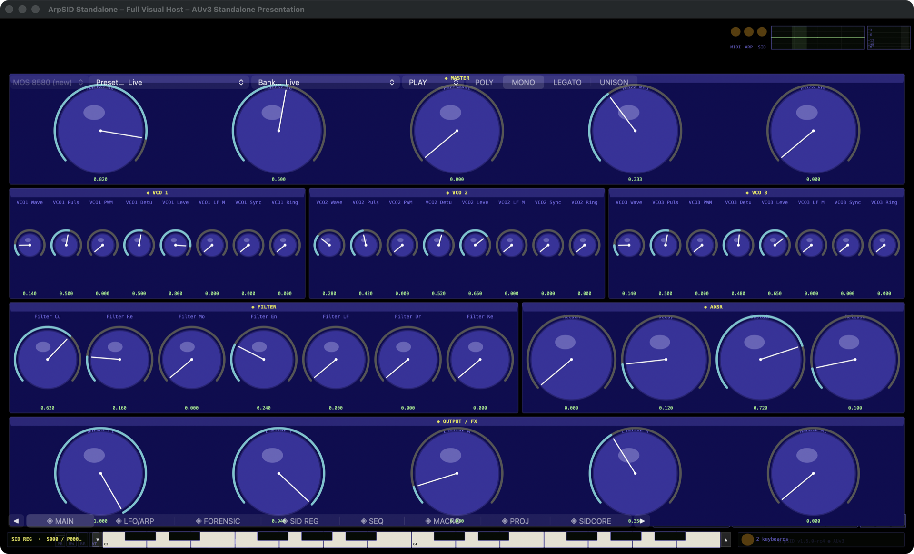
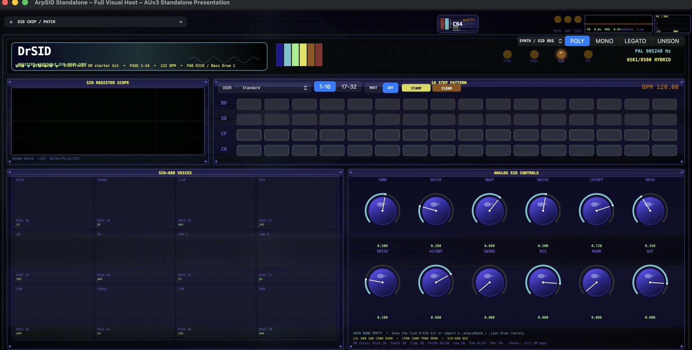
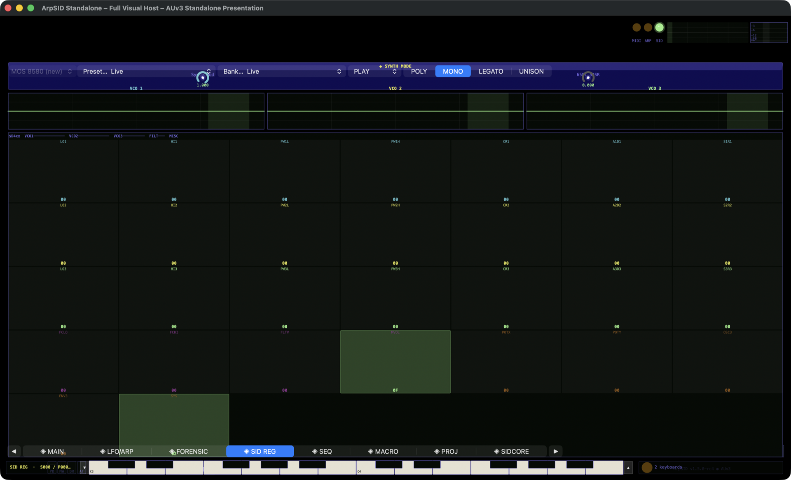
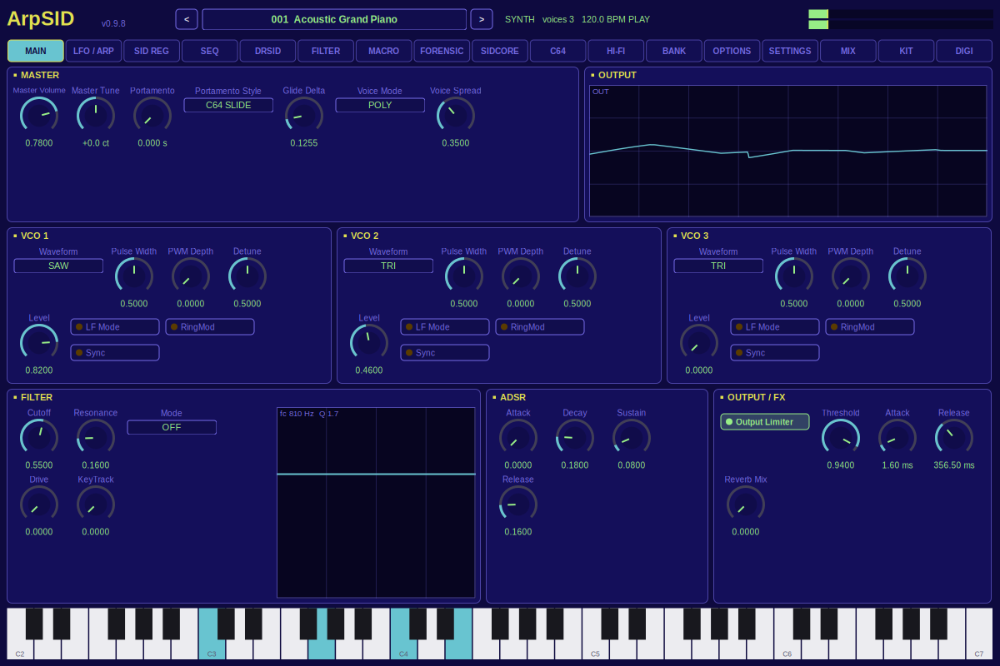
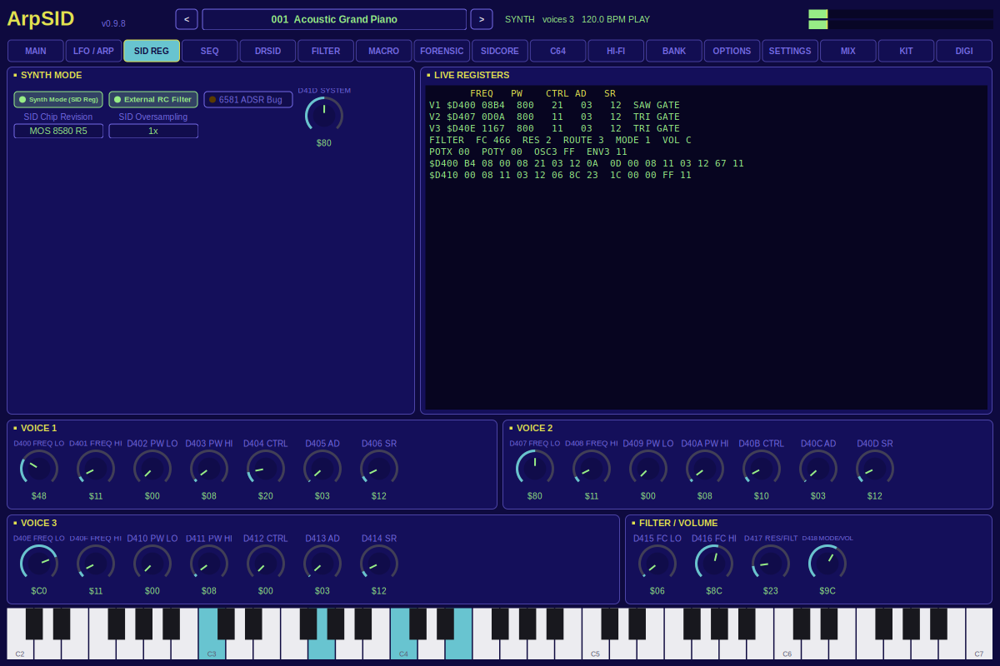
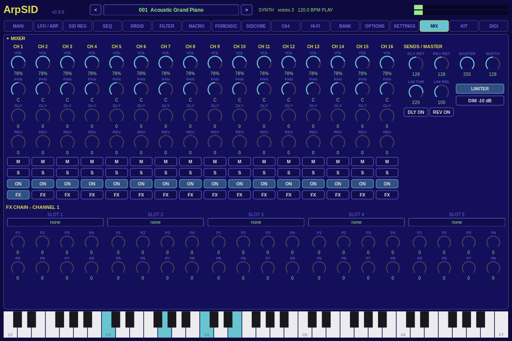
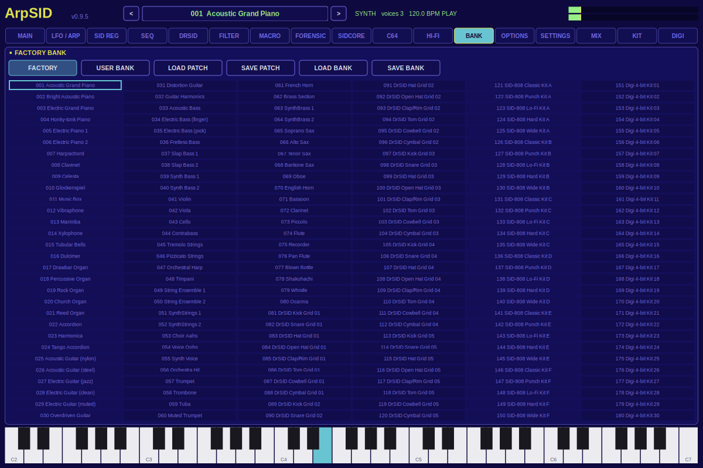

# ArpSID 0.9.7

**A Commodore 64 SID synthesizer and C64 tune player as an audio plug-in for macOS.**

ArpSID is a large, SID-accurate instrument built around a single canonical render
pipeline. It ships as Audio Unit (AUv2 and AUv3), VST3, and a standalone macOS host,
and combines faithful MOS 6581/8580 SID emulation, an authentic cycle-exact C64
PSID/RSID tune player, three drum engines, a DIGI sampler with authentic `$D418`
playback, and a full arranger (arpeggiator, 32-step sequencer, kit routing, mixer and
post-FX) — with host-accurate parameter display, automation and state restore.

---

## Screenshots

Captured from the ArpSID standalone host (AUv3 presentation), running the shipped build.



*Main synth view — Master section, three VCO banks (VCO1–3), the multimode Filter, ADSR envelope and the Output/FX stage.*



*DrSID register/wavetable drum core — 16-step pattern grid (BD/SD/CP/CH), the SID-808 voice bank with its General-MIDI note map, the live `$D400–$D418` register scope, and the Analog SID control bank.*



*SID-register (`$D400`) monitor — per-voice VCO, filter and envelope register read-outs for direct SynthMode inspection.*

### VST3 editor on Windows and Linux

The Windows and Linux VST3 has the same 17 tabs, rendered with VSTGUI. These
images come from `arpsid_vst3_editor_check`, which draws every tab offscreen
with the engine running (a four-note chord held on the factory patch).
**All 17 tabs, with a guide to each, are in [docs/VST3_EDITOR.md](docs/VST3_EDITOR.md).**
Regenerate the images with `scripts/update_editor_screenshots.sh build-vst3`.



*MAIN — master, three VCOs, filter with live response curve, ADSR, output limiter and the live output scope.*

| | |
|---|---|
|  |  |
| *SID REG — every `$D400–$D41D` register as a control, next to the live register readout.* | *MIX — 16 channel strips, sends, master and the per-channel FX chain.* |
|  | |
| *BANK — the 180 factory patches and the user bank, with `.arpsid` / `.arpsidbank` load and save.* | |

---

## Plug-in formats

| Format | Platforms | Notes |
|---|---|---|
| **AUv2** (`aumu`, manufacturer `ASID`) | macOS (universal) | Five component flavors: `ArpS` (ArpSID), `ArIn` (ArpSID Instrument), `DrSD` (DrSID drum machine), `S808` (SID-808), `C64P` (C64 tune player). |
| **AUv3** | macOS (universal) | App extension inside the Logic-compatible `ArpSID.app`. |
| **VST3** | macOS (universal), Windows x64 + arm64, Linux x86_64 + aarch64 | Runs the same engine as the AU and Standalone (MIX, KIT, DIGI, SETTINGS, C64 player). Full ArpSID editor on every platform: the native editor on macOS, a VSTGUI editor with the same 17 tabs on Windows and Linux. |
| **Standalone** | macOS (universal) | `ArpSID Standalone.app` host with keyboard, transport and preset browser. |

Every [release](https://github.com/djayuffe/ArpSID-public/releases) ships all
of these as separate downloads, built and validated by CI.

All formats run one engine, `ArpSIDDSPKernel` (canonical core plus the
KIT/DIGI/MIX layers); the AU, AUv3, Standalone and VST3 wrappers only adapt
host events, state and the editor to it.

## Sound engines

Each SID exposes three independent voices — triangle, sawtooth, variable-pulse and
noise waveforms, with per-voice pulse-width modulation, ring modulation and hard sync —
feeding one shared multimode filter (low-, band- and high-pass, selectable per voice)
and a master volume. ArpSID drives that silicon through several complementary engines:

- **BitPerfect / classic SID** — SID-accurate register, waveform, ADSR and multimode
  filter behavior; glide/portamento laws; fractional-cycle rendering.
- **SID-register / SynthMode** — direct `$D400`-register synthesis with a canonical
  voice-token identity model (real host note IDs are protected; anonymous/replayed
  notes use stable synthetic identities).
- **DrSID drum synthesis** — a distinct drum authority with per-hit register
  microprograms and two machine models (SID-authentic drum core and Analog X0X-8):
  kick, snare, closed/open hat, clap, cowbell, tom, rim.
- **SID-808** — an authored x0x-style analog projection with staged musical shapes
  (kick pitch-drop stages, tom pitch movement, hat ring/tail, clap burst train,
  cowbell partial/tail) and its own factory range.
- **DIGI sampler + authentic `$D418`** — import or record samples (decimated to the
  canonical ~8 kHz 4-bit `$D418` nibble stream) and authentic volume-DAC digi playback
  that follows the active PAL/NTSC SID clock.
- **C64 PSID/RSID player** — a cycle-exact PHI2 machine (NMOS 6510 CPU, CIA/VIC-II,
  open-bus, PLA) that runs real `.sid` tunes, with honest strict-RSID vs. compatible
  execution reporting.

## Arranger, routing and modulation

- **Arpeggiator** — mono/legato/unison/poly, fixed and host-synced rates, gate length,
  swing, octave range, hold/latch, transpose, portamento glide; internal gates are
  materialized into the canonical event queue at exact sample offsets.
- **32-step sequencer** — per-step note/velocity/gate, swing, internal or host-tempo
  following; explicit per-step boundaries shared by melodic events, KIT, float DIGI and
  authentic `$D418`.
- **KIT routing** — multi-target drum routing across DrSID / SID-808 / DIGI.
- **MIX** — per-voice volume/pan/mute/solo and insert FX.
- **Modulation matrix** — four LFOs plus velocity, note, key-follow, mod-wheel,
  pitch-bend, aftertouch, poly-pressure, random, eight macros and an envelope, routed to
  filter, oscillator, pulse-width, volume and LFO-rate targets.

## Post-FX

Reverb, output limiter, and the "Hi-Fi Transcendence" chain (oversampling, tape
saturation, analog warmth, psycho-exciter, stereo width, voice diffuser). All post-FX
parameter changes are applied on the exact canonical sample timeline — a value that
arrives at sample K never affects samples before K.

## SID authenticity and forensic modeling

- Three chip revisions selectable: MOS 6581 R2 / R3 / R4 and MOS 8580 R5.
- PAL and NTSC clock domains, with sample-boundary-safe transitions.
- Optional forensic analog modeling: clock jitter, supply ripple, thermal drift, voice
  crosstalk, external bleed, die temperature, supply voltage, per-chip seed, filter
  ohmic behavior and more.

## Host integration

- **Parameter presentation authority** — one shared, parameter-ID-aware service formats
  and parses every host-visible parameter across AUv2/AUv3/VST3 using the *same*
  canonical DSP laws (so displayed values match what the engine actually renders), with
  Unicode-safe VST3 strings.
- **Full parameter automation** — every host-visible parameter is automatable, and value
  changes take effect on the exact canonical sample timeline.
- MIDI CC → parameter mapping, opt-in GM channel-10 drum promotion, and PAL/NTSC-aware
  note handling.

## Standalone host & GUI

- **Standalone macOS host** — a full "visual host" shell that loads the AUv3 presentation
  with an on-screen velocity keyboard, transport (play / stop / record), tempo control and
  a preset/bank browser, so the instrument runs without a DAW.
- **Tabbed editor** — a MAIN synth panel (Master, three VCO banks, multimode filter, ADSR
  and Output/FX) plus dedicated LFO/ARP, SEQ, MACRO, KIT, DIGI, MIX, FORENSIC and SIDCORE
  pages.
- **Live SID register scope** — a `$D400–$D418` register monitor with per-voice VCO,
  filter and envelope read-outs plus PK/RMS output metering, driven only by
  render-published telemetry.
- **DrSID drum view** — a 16-step pattern grid, the SID-808 voice bank with its
  General-MIDI note map, and the Analog SID control bank.

See the [Screenshots](#screenshots) above.

## Presets, banks and state

- **180-slot factory patch bank** spanning the synth, DrSID, SID-808 and DIGI families.
- **User banks and kits** — save and recall user patches and drum kits, and import/export
  DrSID kits as `.arpsidbank` / `.json` drum libraries.
- **Full state restore** — the complete instrument state, including the DIGI user-sample
  bank, is serialized for host save/restore and cross-format state transfer.

## Architecture highlights

- **Canonical render pipeline** — one timed-event ordering authority survives ingress,
  storage and dispatch; structural (engine/model/PAL-NTSC) changes are sample-boundary
  safe; no-output blocks still advance the full pipeline into fixed scratch.
- **Realtime-safe** — render paths are lock-free, allocation-free and bounded; heavy
  producer work (parsing, canonicalization, file I/O) happens off the render thread and
  is published through mailboxes.
- **Render-owned telemetry** — the GUI consumes immutable/atomic snapshots with frame-ID
  coherence rather than reading live render state.
- **C64 render transactions** — a play/service attempt that may overflow rolls back CPU,
  CIA/VIC, RAM/Color-RAM, SID bridge and diagnostics atomically.

## Building

Requires a C++17 toolchain and CMake. On macOS, Xcode provides the AU/AUv3/standalone
toolchain; VST3 additionally needs the Steinberg VST3 SDK on the include path.

```bash
# Configure + build (Linux-buildable core + tests)
./build.sh --build-dir build-release --config Release --parallel 4

# Full test suite
ctest --test-dir build-release --output-on-failure

# macOS: build, install and strict-validate the AUv2 component
./build.sh --install-auv2 --clear-au-cache --validate-auv2 --parallel 8

# Create a clean source release archive
./build.sh --package-release --parallel 4

# AddressSanitizer + UBSan build of the test suite (GCC/Clang)
./build.sh --sanitize --build-dir build-asan --config RelWithDebInfo

# VST3 (any platform, full editor everywhere). Needs the Steinberg VST3 SDK
# and, on Linux, the VSTGUI editor toolkit packages (Debian/Ubuntu):
#   sudo apt-get install libx11-xcb-dev libxcb-util-dev libxcb-cursor-dev \
#     libxcb-keysyms1-dev libxcb-xkb-dev libxkbcommon-dev libxkbcommon-x11-dev \
#     libcairo2-dev libpango1.0-dev libfontconfig1-dev libfreetype-dev \
#     libwayland-dev wayland-protocols
git clone --depth 1 --branch v3.8.1_build_84 --recurse-submodules --shallow-submodules \
    https://github.com/steinbergmedia/vst3sdk.git ~/vst3sdk
./build.sh --no-tests --build-dir build-vst3 --vst3-sdk ~/vst3sdk --install-vst3
```

`--vst3-sdk` builds `arpsid_vst3` (the build runs the Steinberg validator) and
the headless host integration test (`arpsid_vst3_host_check`). On Linux and
Windows, `arpsid_vst3_editor_check` renders every editor tab offscreen to
`build-vst3/editor-snapshots/*.png` and checks the parameter binding. `--install-vst3`
copies the bundle to `~/.vst3` on Linux (`arpsid_vst3_install_user`,
override with `-DARPSID_USER_VST3_DIR=...`) or the user VST3 folder on macOS.
The equivalent raw CMake steps:

```bash
cmake -S . -B build-vst3 -G Ninja -DCMAKE_BUILD_TYPE=Release \
      -DARPSID_BUILD_VST3=ON -Dvst3sdk_SOURCE_DIR=$HOME/vst3sdk
cmake --build build-vst3 --target arpsid_vst3 arpsid_vst3_host_check
cmake --build build-vst3 --target arpsid_vst3_install_user        # ~/.vst3
sudo cmake --install build-vst3 --prefix /usr                     # /usr/lib/vst3
```

On Linux, `ccache` is used automatically when installed
(`-DARPSID_USE_CCACHE=OFF` to disable).

Repository guards (run before/after changes):

```bash
python3 scripts/check_version_coherence.py
python3 scripts/verify_source_tree.py
python3 scripts/check_audit_closure.py
```

## Testing

The CTest suite (~475 tests) spans unit, runtime-behavior, audio-shape,
timing/clock-conservation, state/persistence, GUI-wiring and source-contract
classes:

```bash
cmake -S . -B build -G Ninja -DCMAKE_BUILD_TYPE=Release -DARPSID_BUILD_TESTS=ON
cmake --build build
ctest --test-dir build --output-on-failure -j4
```

## CI and releases

GitHub Actions (`.github/workflows/`) runs on every push to `main` and on pull
requests:

| Job | What it checks |
|---|---|
| `linux` | Repository guards, full build and full CTest suite with GCC and with Clang. |
| `linux-sanitizers` | Full CTest suite under AddressSanitizer + UndefinedBehaviorSanitizer. |
| `linux-vst3` | VST3 for x86_64 and aarch64 + Steinberg SDK validator + VST3 host integration test + offscreen render of every editor tab + install layout. |
| `windows-vst3` | VST3 (MSVC) for x64 and arm64 + Steinberg SDK validator + VST3 host integration test + offscreen editor render. |
| `macos` | AUv2 (all five flavors) + VST3 build, code-signature check, strict `auval`, VST3 host integration test. Public repository only. |
| `macos-apps` | Standalone app + AUv3 (Logic-compatible app): bundle/signature checks and a Standalone launch test. Public repository only. |

Every job fails on any ArpSID compiler or linker warning, and the macOS job
fails on any `auval` warning.

**Making a release** (public repository):

1. Bump `VERSION.txt`, `project(VERSION)` in `CMakeLists.txt`,
   `include/arpsid/version.h` and the README title, and add a
   `## [x.y.z]` entry to `CHANGELOG.md` (`python3 scripts/check_version_coherence.py`
   checks they agree).
2. Push to `main`. The **Release** workflow sees the `VERSION.txt` change,
   reruns the whole pipeline and publishes `vx.y.z` with every product
   variant (see the formats table above), the source zip and
   `SHA256SUMS.txt`. Pushing a
   `vx.y.z` tag works too, and a manual run rebuilds an existing release.

Releases are only published from the public repository and refuse any tree
that carries the real C64 ROMs (`scripts/ci/check_public_tree.sh`). From the
private repository, mirror a commit with
`scripts/sync_public_mirror.sh <path-to-ArpSID-public> --push`: it copies
everything except the ROM files and runs the same guard before committing.

## Documentation

| Document | Contents |
|---|---|
| [`CHANGELOG.md`](CHANGELOG.md) | Release notes. |
| [`docs/ARCHITECTURE.md`](docs/ARCHITECTURE.md) | System architecture: layers, kernel block pipeline, engines, parameters, state, GUI models and telemetry, wrappers. |
| [`docs/PARAMETER_REFERENCE.md`](docs/PARAMETER_REFERENCE.md) | Every parameter: ID, default, values, steps and editor tab (generated from the code and checked by a test). |
| [`docs/VST3_EDITOR.md`](docs/VST3_EDITOR.md) | The Windows/Linux VST3 editor: a screenshot and guide for all 17 tabs, the controls, and how the editor code works. |
| [`docs/VST3_IMPLEMENTATION.md`](docs/VST3_IMPLEMENTATION.md) | VST3 internals: processor, kernel host, state format v5, controller, MIDI mapping, messages, threading, tests. |
| [`docs/REALTIME_OWNERSHIP.md`](docs/REALTIME_OWNERSHIP.md) | Which code runs on the render thread vs. the producer side. |
| [`docs/REALTIME_ROLLBACK_JOURNAL.md`](docs/REALTIME_ROLLBACK_JOURNAL.md) | Rollback-safe C64 render transactions. |
| [`docs/TAB_ARCHITECTURE.md`](docs/TAB_ARCHITECTURE.md) | The 17-tab production ring, persisted tab IDs and invariants. |
| [`docs/D418_NIBBLE_SPEC.md`](docs/D418_NIBBLE_SPEC.md) | DIGI `$D418` 4-bit sample format. |
| [`docs/SID_FILE_FORMAT_NOTES.md`](docs/SID_FILE_FORMAT_NOTES.md) | PSID/RSID handling. |
| [`docs/C64_EXACTNESS_BOUNDARIES.md`](docs/C64_EXACTNESS_BOUNDARIES.md) | What the C64 player does and does not claim. |
| [`packaging/macos/`](packaging/macos/) | Signing, notarization and release sign-off checklists. |

## Project layout

| Path | Contents |
|---|---|
| `include/arpsid/core/` | Canonical runtime, event queue, timing, C64 machine, post-FX, telemetry. |
| `include/arpsid/engines/` | BitPerfect, arpeggiator, DrSID, SID-808, DIGI sampler / `$D418`. |
| `include/arpsid/gui/`, `include/arpsid/patchbank/` | GUI models; factory patch/kit banks. |
| `source/au2/`, `source/au3/` | AUv2 component, AUv3, DSP kernel, view controller. |
| `source/vst3/`, `source/arpsid_controller.cpp`, `source/gui/` | VST3 processor, kernel host, controller; Cocoa bridge and cross-platform VSTGUI editor (`source/gui/vstgui/`). |
| `source/tests/`, `scripts/` | Test suite; build/validation/guard scripts. |

## Status and validation limits

Verified on the Linux-buildable core with a green test suite. The
following remain external, platform sign-off items and are **not** claimed as verified:
macOS AUv2/AUv3 + Logic host validation, code signing / notarization / installer, a full
third-party DAW host matrix, fuzz coverage, and
strict physical C64 exactness beyond the documented boundaries
([`docs/C64_EXACTNESS_BOUNDARIES.md`](docs/C64_EXACTNESS_BOUNDARIES.md)).

## Licensing

ArpSID is **Copyright (C) 2024-2026 Ulf Bertilsson** and is licensed under the
**GNU General Public License, version 3 or later (GPL-3.0-or-later)** — see the
[`LICENSE`](LICENSE) file. Some source files also carry earlier per-file
BSD-3-Clause / MIT SPDX headers; those permissive terms are GPL-compatible, and
the project as a whole is distributed under the GPL.

**C64 ROMs are not covered by this license.** The Commodore KERNAL, BASIC and
CHARGEN ROM images are copyrighted by their respective owners. Public source
releases do **not** bundle them (`c64_embedded_roms.h` ships zero-filled
placeholders); supply your own dumps at runtime. Do not redistribute the ROMs
without appropriate rights.
