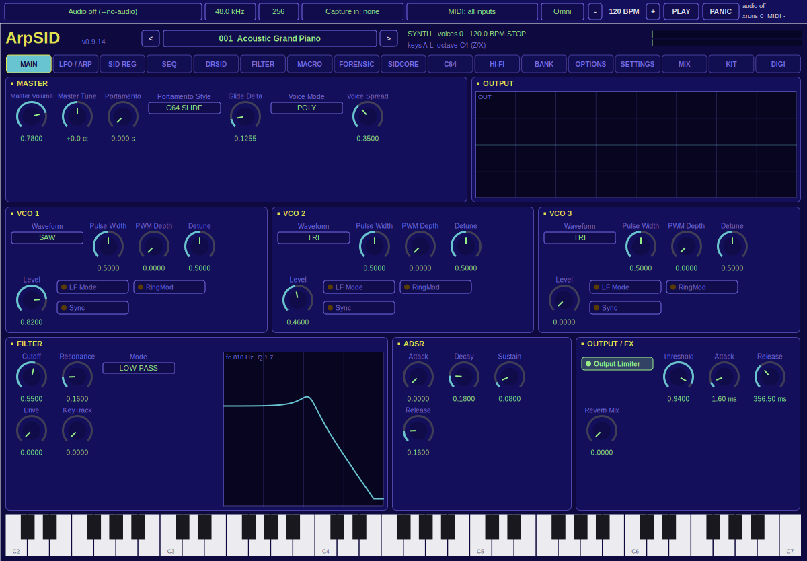

# ArpSID standalone app (Windows and Linux)

ArpSID runs without a DAW: `ArpSID.exe` on Windows, `ArpSID` on Linux. It is
the same engine the plug-ins run (`ArpSIDDSPKernel` through
`Vst3KernelHost`) and the same editor as the Windows/Linux VST3 (all 17 tabs,
see [VST3_EDITOR.md](VST3_EDITOR.md)), in a window of its own with a bar for
audio, MIDI and the clock above it. macOS has its own native app,
`ArpSID Standalone.app` (see [AU_EDITOR.md](AU_EDITOR.md)).

Downloads: `standalone-windows-x64`, `standalone-windows-arm64`,
`standalone-windows-x86`, `standalone-linux-x86_64` and
`standalone-linux-aarch64` on the
[releases page](https://github.com/djayuffe/ArpSID-public/releases).
Installing: [INSTALL.md](INSTALL.md#standalone-app-windows-and-linux).

## The bar

From left to right:

| Control | What it does |
|---|---|
| **Audio output** | The audio API and device. Windows: WASAPI and DirectSound; Linux: PulseAudio (also PipeWire's Pulse service), ALSA and, in builds that have it, JACK. Each API has a *default output* entry that follows the system default. The list is read when you open the menu, so devices plugged in later show up. |
| **Sample rate** | 44.1, 48, 88.2 or 96 kHz. If the device runs at another rate, ArpSID uses the device's rate. |
| **Buffer** | 64 to 2048 frames per audio callback. Smaller means less latency and more CPU. |
| **Capture in** | An input device for the DIGI tab's REC (sample capture), or none. The input opens together with the output; if the pair cannot run together, the output opens alone. |
| **MIDI** | *All inputs* (default; ports plugged in later are picked up within two seconds), *none*, or one port. On Linux ArpSID also offers a virtual input, **ArpSID MIDI In**, that other programs (a DAW, `aconnect`) can connect to. |
| **Channel** | *Omni* or one MIDI channel. The editor's keyboard always plays. |
| **− BPM +** | Tempo of the internal clock (20–300) for the arpeggiator, the sequencer and LFO sync. |
| **PLAY / STOP** | Runs the clock from the top. MIDI Start, Continue and Stop do the same. |
| **PANIC** | Sustain off, all notes off and all sound off on every channel. |
| Status | Latency, engine load, audio dropouts (xruns) and a MIDI activity mark. |

Everything else is the editor: patches in the header and the BANK tab, the
computer keyboard as a piano (A W S E D F T G Y H U J K O L, Z/X octave), the
SETTINGS, MIX, KIT, DIGI and C64 tabs. With no audio device ArpSID keeps
running silently, so you can still edit and save.

## Patches and presets

- **Factory patches** from the header (`<` / menu / `>`) or the BANK tab.
- **Presets** are the same `.vstpreset` files the VST3 uses, in the same
  folders: BANK → PRESETS lists your own presets, LOAD PRESET opens any
  ArpSID preset, SAVE PRESET writes the current patch into
  `<user preset folder>/User/` (Windows: `Documents\VST3 Presets\Uber Sound
  Solutions\ArpSID`, Linux: `~/.vst3/presets/Uber Sound Solutions/ArpSID`).
  A preset saved in the app shows up in the plug-in, and the other way round.
- **Patch and bank files** (`.arpsid`, `.arpsidbank`) work as in the
  plug-in.
- **MIDI Program Change** selects a factory patch: program 0–127 is patch
  001–128, and after Bank Select (CC 0) = 1, programs 0–51 are patches
  129–180. (In the plug-in the host does this through the program list.)

## What is saved

On exit (and every 30 seconds after a change) ArpSID saves:

| File | Contents |
|---|---|
| `standalone.conf` | Audio API, devices, sample rate, buffer, MIDI input and channel, tempo, window size, last tab (plain `key = value` text). |
| `session.arpsidstate` | The sound: the patch and every engine setting, the SETTINGS / MIX / KIT / DIGI models with the sample bank, a loaded C64 tune, and the user patch name. |

They live in `%APPDATA%\ArpSID\` (Windows) and `~/.config/ArpSID/` (Linux,
`$XDG_CONFIG_HOME/ArpSID/` when set). Delete them to start from scratch.

## Command line

| Option | Effect |
|---|---|
| `--list-devices` | Print the audio APIs and devices, the MIDI inputs and the config and preset folders, then exit. |
| `--no-audio` | Run without an audio device. |
| `--no-midi` | Run without MIDI input. |
| `--config-dir DIR` | Keep settings and the session in `DIR` (e.g. a portable install). |
| `--quit-after MS` | Close after `MS` milliseconds (tests). |
| `--screenshot FILE` | With `--quit-after`: save the window as a PNG first. |
| `--version` | Print the version. |

On Windows, run it from a console to see the output of these options.

## Window

The window keeps the editor's proportions; drag a corner to scale it
(0.5× to 3×). The size is remembered. On Windows it follows the monitor's
DPI scale; on Linux it is an X11 window (XWayland under Wayland).

## Troubleshooting

- **No sound.** Check the output menu: *Audio off* means no device opened
  (the status says why). Pick another output or API. On Linux, if ALSA
  devices are busy, choose the PulseAudio entry.
- **Crackles.** Raise the buffer size; watch the xrun count.
- **No MIDI.** Choose *MIDI: all inputs* and check the channel (Omni). On
  Linux the MIDI inputs need the ALSA sequencer (`snd-seq` kernel module).
- **Linux: missing libraries.** Run `./install.sh --check` from the zip; it
  lists them and the packages to install.

## How it is built

| File | Role |
|---|---|
| `source/standalone/arpsid_standalone_engine.*` | The engine side, independent of any audio library: the audio callback body (render, DIGI capture input), the internal clock, MIDI channel filter, MIDI Start/Stop, panic, patch names, the session blob. Tested headless (`StandaloneEngineTests`). |
| `source/standalone/arpsid_standalone_devices.*` | RtAudio (stereo float, non-interleaved, real-time callback thread) and RtMidi (one input per port, plus the Linux virtual input). MIDI goes straight into the engine's lock-free MIDI queue from the MIDI thread. |
| `source/standalone/arpsid_standalone_app.*` | The bar, the editor backend (parameters, patches, presets, models through the engine), settings and session files, the 30 Hz UI timer (editor refresh, MIDI hot-plug, autosave; renders silently when no audio stream runs). |
| `source/standalone/arpsid_standalone_win32.cpp`, `..._x11.cpp` | The native window: Win32 (per-monitor DPI aware) or X11/xcb with a `poll()` run loop serving VSTGUI's file descriptors and timers. |
| `source/standalone/arpsid_standalone_settings.h` | Settings file format and folders. |
| `cmake/ArpSIDStandaloneApp.cmake` | Fetches RtAudio 6.0.1 and RtMidi 6.0.0 (MIT-style licences) or uses `-DARPSID_RTAUDIO_DIR` / `-DARPSID_RTMIDI_DIR`, builds them with the platform's APIs, and builds `ArpSID` (target `arpsid_standalone_app`). |

Build it with the VST3 build (it needs the VST3 SDK for VSTGUI and the
preset file code): it is on by default on Windows and Linux
(`-DARPSID_BUILD_STANDALONE_APP=OFF` turns it off). Linux also needs the
ALSA development package (`scripts/linux/install_build_deps.sh` installs it
and PulseAudio's). `cmake --build <dir> --target arpsid_standalone_check`
starts the app without audio or MIDI, renders the window to a PNG, saves the
settings and session and quits; CI runs it on every Windows and Linux build
(under Xvfb on Linux).
